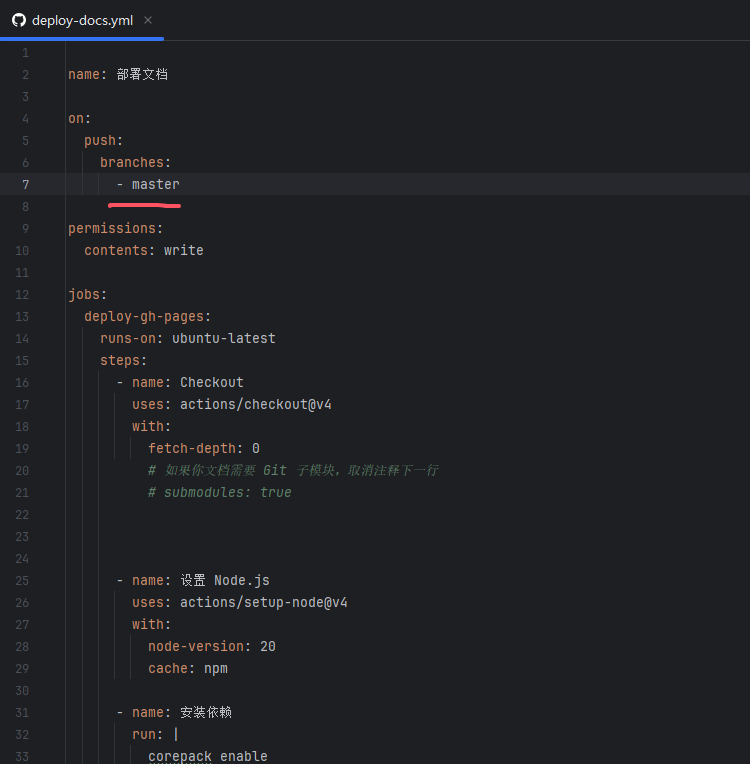
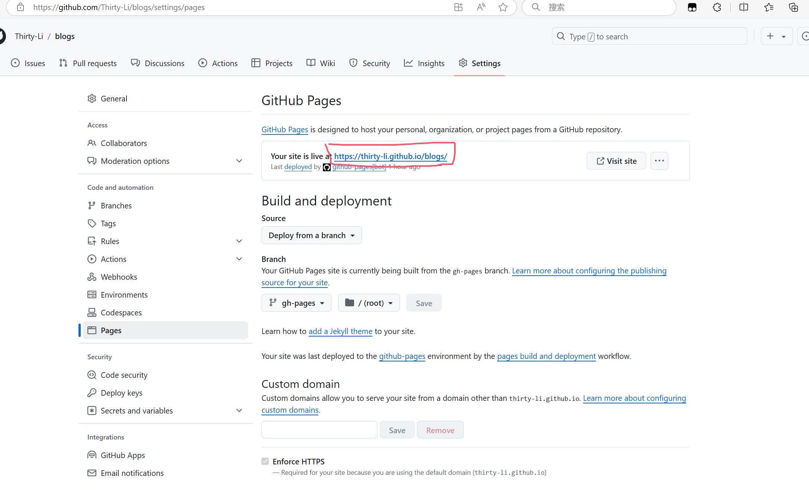

本教程指引你如何部署 VuePress 项目。

## 推送代码到 Github

1. 首先你需要创建一个 `GitHub` 的仓库，仓库地址是一个普通的形如 `https://github.com/<USERNAME>/<REPO>` 的格式。

2. 初始化 Git 仓库
```bash
git init
```
3. 连接到远程仓库
```bash
git remote add origin https://github.com/<USERNAME>/<REPO>
```
4. 将当前目录下的所有更改（包括新增、修改或删除的文件）添加到暂存区，准备进行下一次提交
```bash
git add .
```
::: info 如果出现有关`CRLF`、`LF`之类换行符的报错，执行以下命令之一：
```bash
git config --global core.autocrlf true
```
```bash
git add --renormalize .
```
:::
5. 将当前暂存区中的更改提交到本地 `Git` 仓库
```bash
git commit -m "提交信息"
```
6. 将本地 `Git` 仓库中的更改推送到远程仓库
```bash
git push origin 分支
```
::: tip 分支具体查看`.github\workflows\deploy-docs.yml`文件



:::
7. 静态部署
```bash
npm run docs:build
```

### 使用 Github Pages 发布站点
上一步完成推送后，应该会自动生成 `gh-pages` 分支，前往 `GitHub` 仓库的`Pages`，选择 `gh-pages` 作为 `GitHub Pages` 的源。


你的网站将会被发布到 `https://<USERNAME>.github.io/<REPO>/` 。

