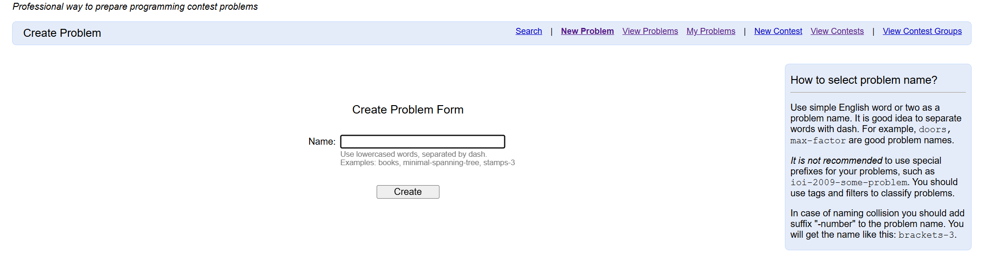
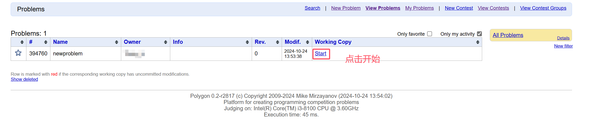
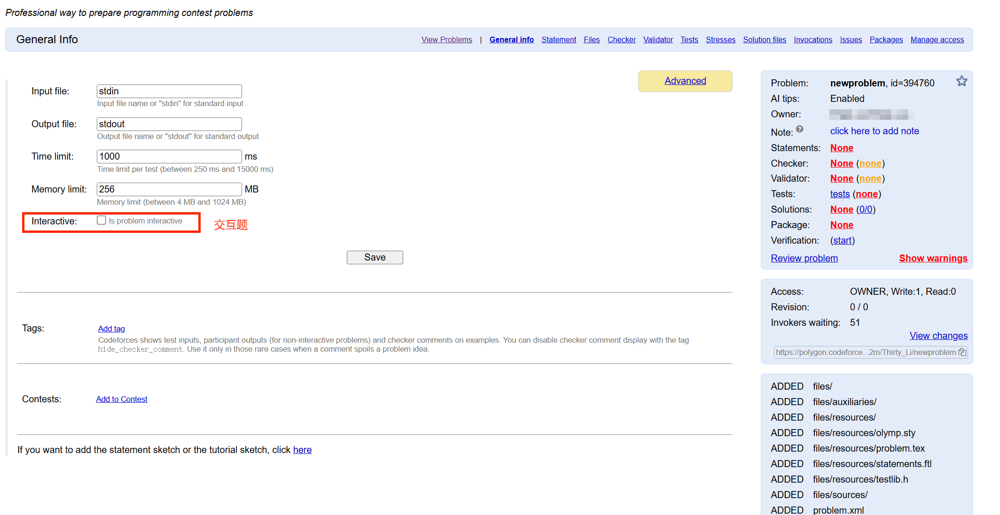
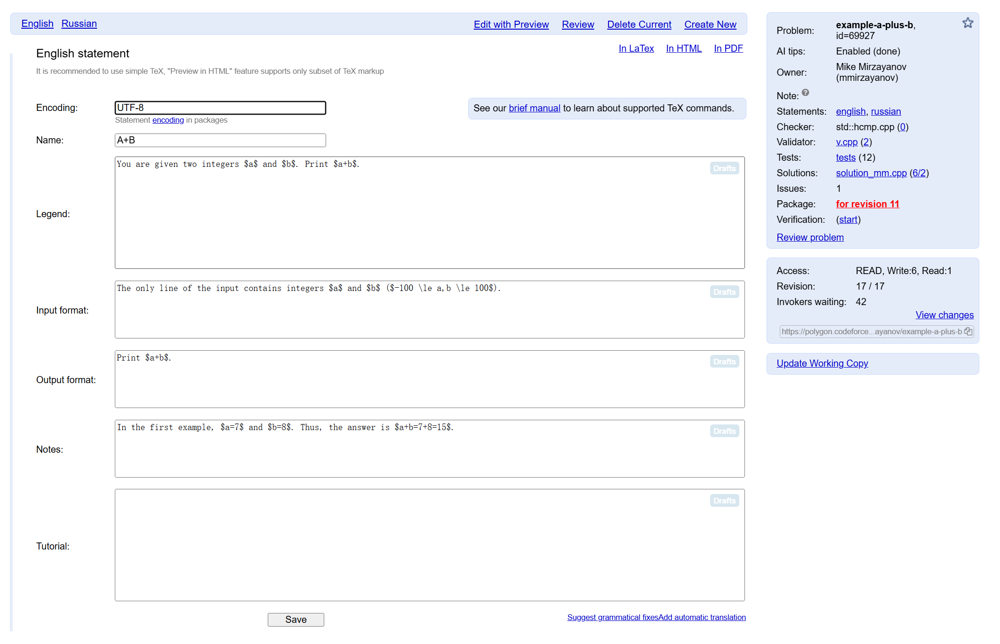
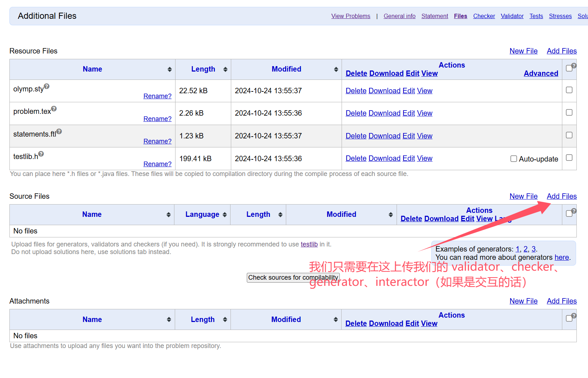
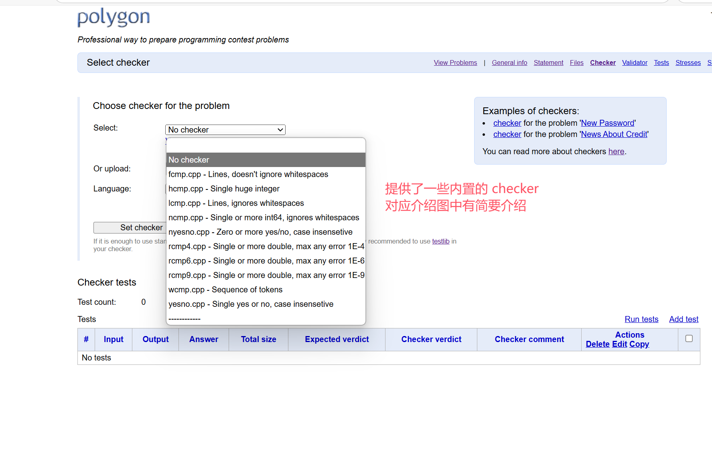
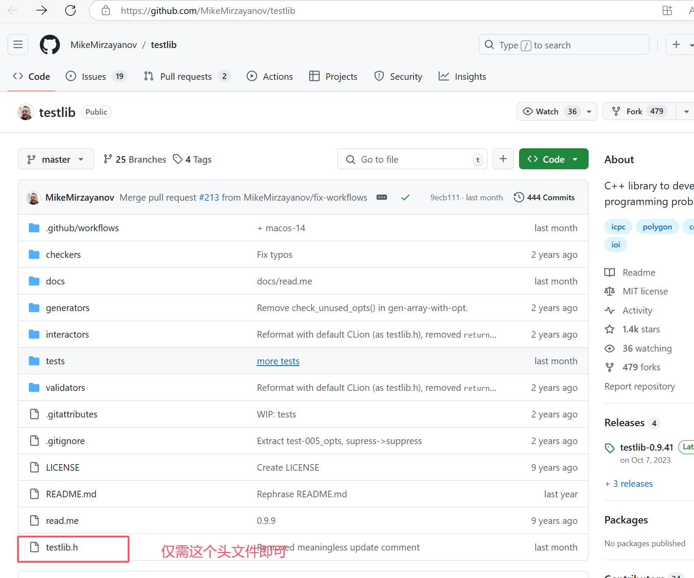
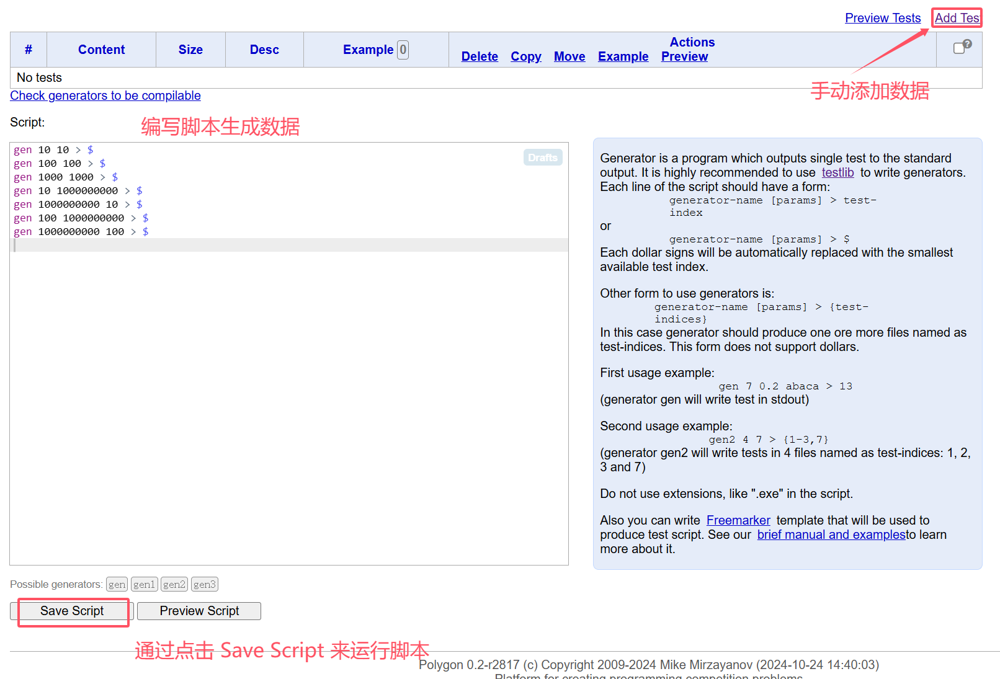
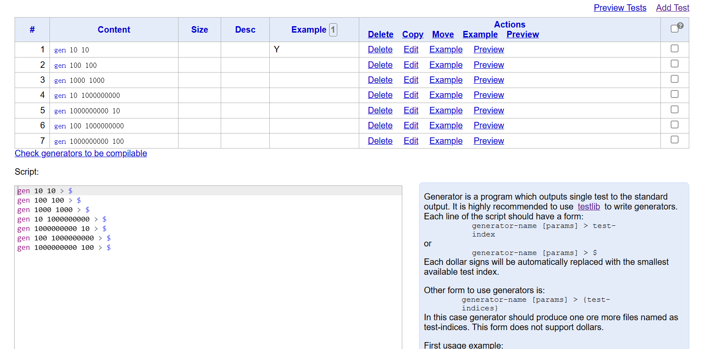

本页面将简要介绍使用多人协作出题平台 Polygon 出题

<!-- more -->

## 📍简介

网址：[Index Page - Polygon](https://polygon.codeforces.com/)

`Polygon` 是一个支持多人协作的出题平台，功能非常完善。官网描述为「`Polygon` 的使命是为创建编程竞赛题目提供平台。」

在 `Codeforces (CF)` 出题必须使用 `Polygon`。在其它地方出题，尤其是多人合作出题时，使用 `Polygon` 也是不错的选择。

优点

>有版本管理系统，多人合作时不会乱成一团，也不需要互相传文件。

>出题系统完善，validator、generator、checker、solutions 环环相扣，输出自动生成。

>可以为 solutions 设置标签，错解 AC、正解未 AC 都会警告，方便地逐一卡掉错解。

>可以方便地对拍，拍出来的数据可以直接添加到题目数据中。

>发现问题可以提 issue，而不会被消息刷屏却一直没有 fix。

>为日后出 CF 做准备。

>……

## 📍题目创建

Polygon 的大部分功能都不需要学，能看懂英文就基本能用了。

进入网址后，先注册登陆，然后点击 New Problem 开始创建一个题目表格，注意此处的 Name 只是项目名，不是最终的题目名。

点击 start 开始编辑题目

### 📌️General Info

在这个页面中可以设置题目的时间限制、空间限制、题目类型（是否为交互题）。

### 📌️Statement

这个页面是用来写题面和题解的。还可以通过 "Review" 按钮来查看题面、validator 与 checker，一般用于审核。
可以通过最上方的 "In HTML" 链接查看渲染后的题面，通过 "Tutorial in HTML" 查看渲染后的题解。

如果需要在题面中添加图片，需要先在下面的 "Statement Resource Files" 中上传图片，然后在题面中加上 \includegraphics{filename.png}。

::: important 注意

* 题面和题解都需要使用 LaTeX 的语法，不能使用 Markdown。

* 题面编辑内容不包括样例，样例在 Tests 中生成

* 题面编辑完后需要 Save

:::

### 📌️Files

"Source Files" 是用来存放 除了 solutions 外 的其它代码的，如 validator、checker、generator，如果是 IO 式交互题还有 interactor。

如果这些代码需要 include 其它文件，例如 [Tree-Generator](https://github.com/ouuan/Tree-Generator)，需要放在 "Resource Files" 中。

[grader](https://codeforces.com/blog/entry/66916) 式交互参见 官方教程。

### 📌️Checker

testlib.h 提供了一些内置的 checker，在选择框中有简要介绍，也可以选择后再点 "View source" 查看源码。

::: important 注意

后续需要自定义 validator、checker、generator、interactor 文件，均需要包含头文件 `testlib.h`

自行去 [https://github.com/MikeMirzayanov/testlib](https://github.com/MikeMirzayanov/testlib) 将项目 clone 下来

:::

如果需要自己编写 checker，请参考官方 [checker](https://codeforces.com/blog/entry/18431) 教程。

下面的 "Checker tests" 是通过 "Add test" 添加若干组输出以及对应的期望评测结果，然后点击 "Run tests" 就可以测试 checker 是否正确返回了评测结果。

### 📌️Interactor

在 General Info 页面中勾选了 Interactive 才有该选项

仅 IO 式交互题需要，请参考官方 [interactor](https://codeforces.com/blog/entry/18455) 教程。

### 📌️Validator

validator 用来检测数据合法性，编写请参考官方 [validator](https://codeforces.com/blog/entry/18426) 教程。

下面的 "Validator tests" 类似于 "Checker tests"，需要提供输入和期望是否合法，用来测试 validator。

### 📌️Tests

这个页面是用来管理数据的。

运行脚本后即可得到下述的各个数据，其中点击每个测试点的 Example 可以将测试点设置为样例，即展示在题面中。

测试点的 Example 如果勾选了 "Use in statements"，这组数据就会成为样例，自动加在题面里。

可以参考 [Polygon 提供的教程](https://polygon.codeforces.com/docs/freemarker-manual) 使用 Freemarker 来批量生成脚本。

### 📌️Stresses

这个页面是用来对拍的。

点击 "Add Stress" 就可以添加一组对拍，"Script pattern" 是一个生成数据的脚本，其中可以使用 "[10..100]" 之类的来表示在一个范围内随机选择。

然后运行对拍，如果拍出错就会显示 "Crashed"，并且可以一键把这组数据加到 Tests 中。

### 📌️Solution Files

这个页面是用来放解这道题的代码的，可以是正解也可以是错解。将错解传上来可以便捷地卡掉它们，也可以提醒自己需要卡掉它们。

### 📌️Invocations

这个页面是用来运行 solutions 的。

选择代码和测试点就可以运行了，之后可以在列表里点进去（"View"）查看详细信息。

评测状态 "FL" 表示评测出错了，一般是数据没有过 validate 或者 validator/checker/interactor 之类的 RE 了。"RJ" 有两种情况，一种是出现了 "FL"，另一种是这份代码第一个测试点就没有通过。

如果用时在时限的一半到两倍之间，会用黄色标识出来。

如果数据中存在变量没有达到最小值或最大值，会在最下方提醒。

### 📌️Issues

用来提 Issue 的地方。

### 📌️Packages

Package 包含了一道题的全部信息。Commit Changes 后，点击 Standard 即可进行打包。打包成功后，基本的题目就算创建完成了。

"Verify" 是测试所有 solution 都符合标签（AC、WA、TLE），并且 checker 通过 checker tests，validator 通过 validator tests。

