本教程将指导你如何配置 招聘网站爬虫 的运行环境。

<!-- more -->

## Python 安装

::: info 前言

`人生苦短，快用Python！`

Python作为众多编程语言之一，是学习者比较容易上手的一门语言，有着简单、易学、好用等特点

:::

### 1. 下载安装包[python官网](https://www.python.org/downloads/windows/) 。

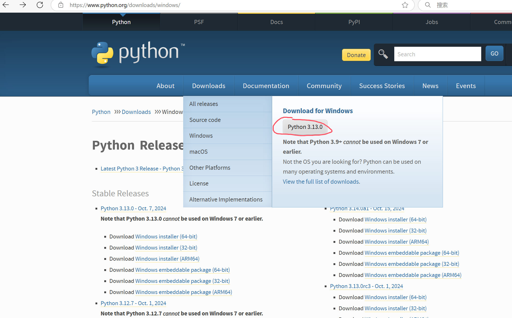

### 2. 运行安装包。
::: info

python安装非常简单，双击下载好的安装包，进入选择安装方式

第一种：Install Now 立即安装，即采用默认安装方式，不能自行指定安装的路径。

第二种：Customize installation 自定义安装，可以自己选择安装的路径（建议自定义安装）。

选择第二种，自定义安装，把最底下Add python.exe to PATH打上勾，否则需要手动添加环境变量

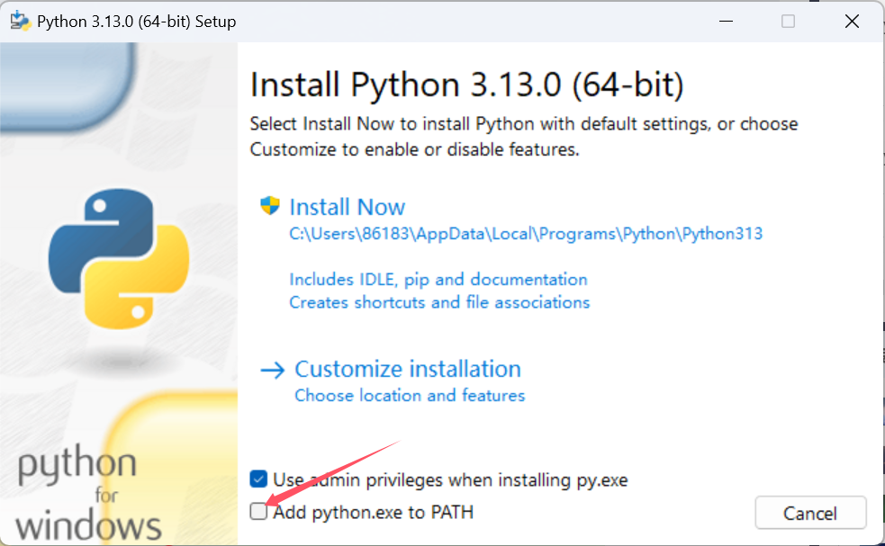

下一步：默认把所有的勾选上即可

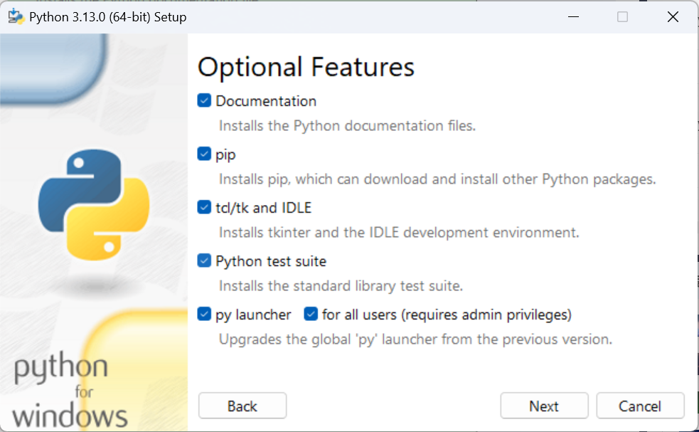

下一步：修改安装路径，建议别安装在C盘。如果没有联网，请不要勾选第六项

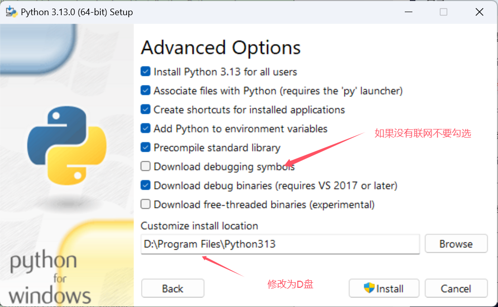

下一步：安装完成，点击Close关闭即可

安装完成之后，使用win+R键输入cmd进入DOS界面，输入python验证，如下图所示即安装成功，继续输入exit()退出即可

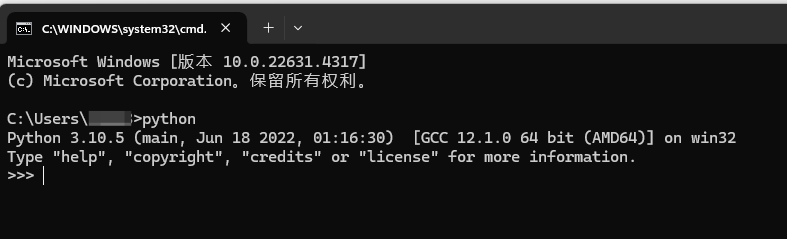

:::

## Pycharm 安装

::: info

PyCharm是一款非常好用的Python IDE，由JetBrains开发而成。

官方下载：[Download PyCharm: Python IDE for Professional Developers by JetBrains](https://www.jetbrains.com/pycharm/download/?section=windows#section=windows)

我下载的是 专业版本

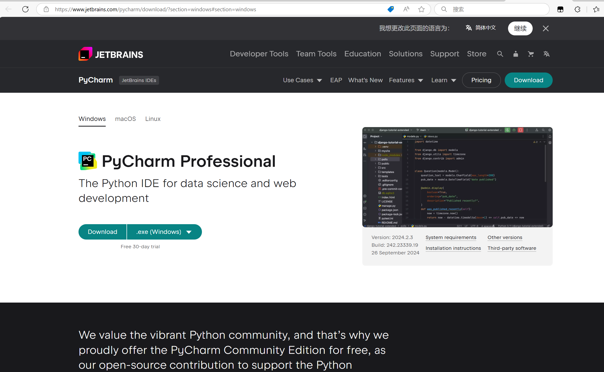

PyCharm针对每个平台都有Professional和Community两个版本，自己可根据自己的需要进行选择。

Professional：专业版（建议选择专业版），功能强大，属于收费版。

Community：社区版，只支持Python开发，开源、免费，用作学习也够用。

:::

### 1. 安装包下载

由于专业版本需要付费，一下包含破解教程

::: warning 警告

涉及版权，自行选择

:::

微信公众号搜索`软件管家`

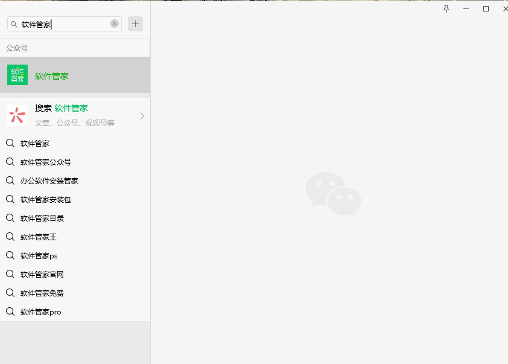

对话中发送`pycharm`


## 2. Pycharm 安装教程

下载的内容为 JetBrains 全家桶，安装教程以IDEA为例子

下面将讲解 Pycharm 的安装教程，破解过程与IDEA一致

首先找到解压包下的安装包

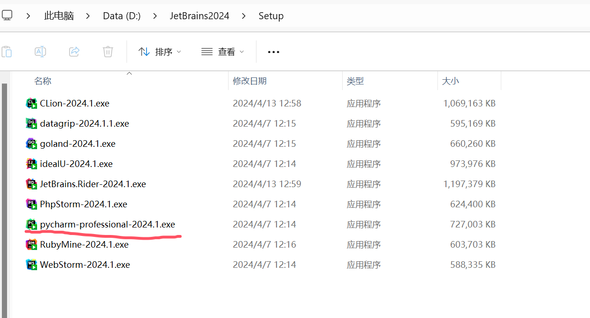

PyCharm的安装通用非常简单，双击进行下一步即可

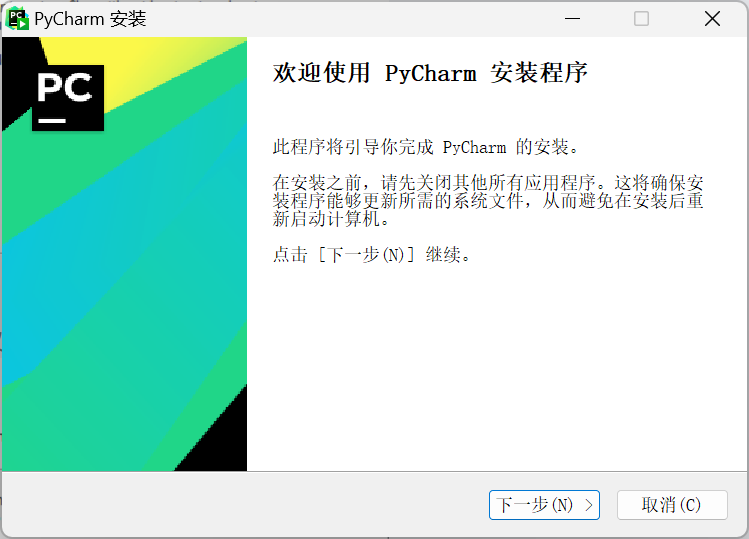

下一步：修改安装路径，建议别放在C盘。

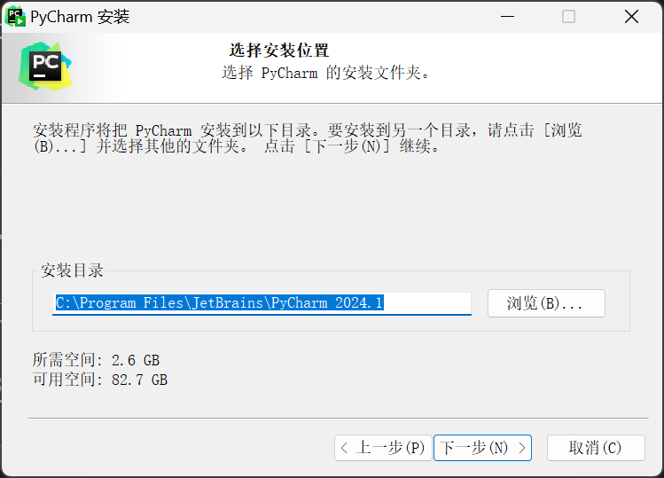

下一步：可以都勾选上

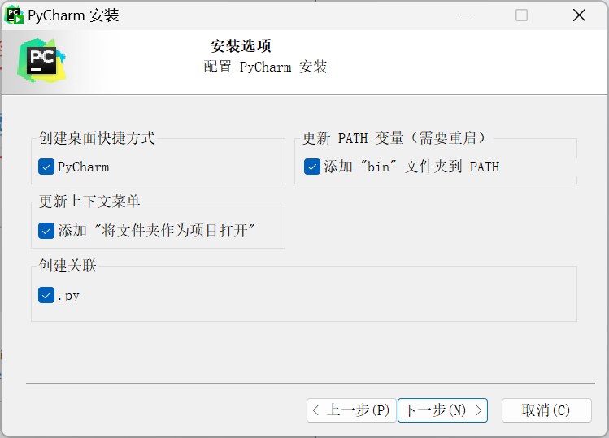

下一步：直接点击Install安装即可

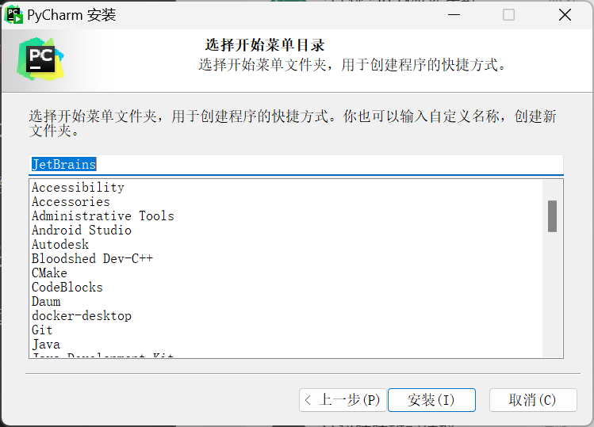

安装完成：点击I want to manually reboot later稍后重启系统

如何破解，请参照公众号文章教程

Pycharm 常用快捷键

```bash
折叠
    Ctrl -: 折叠当前代码
    Ctrl +: 展开当前代码
    Ctrl Shift -: 折叠所有代码
    Ctrl Shift +: 展开所有代码
移动
    Shift+Enter: 在行中间执行时，智能跳到下一行。
    Ctrl+Alt+Enter: 向上插入一行
注释
    Ctrl /: 注释、取消注释行
编辑
    Ctrl + D: 未选中时，复制当前行到下一行，选中时复制粘贴选中部分。
删除
    Ctrl + Y: 删除当前行
查看
    Ctrl + Q: 查看文档
缩进
    Shift + Tab: 反向退格
替换
    Ctrl + r: 替换
```

以上就是Python+Pycharm的详细安装过程，及PyCharm的使用！
