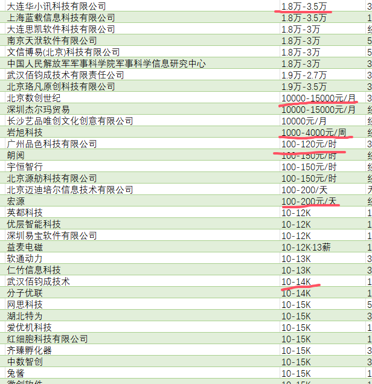

本教程将指导你如何处理 爬取 招聘网站 后的求职信息 。

<!-- more -->

## 1. 数据合并

前面我们获取了两个网站的数据，我们现在将两个网站数据进行合并

``` python
def merge_and_deduplicate(file1, file2, output_file):
    # 读取两个 CSV 文件的数据
    df1 = pd.read_csv(file1)
    df2 = pd.read_csv(file2)

    # 合并两个 DataFrame
    df_combined = pd.concat([df1, df2])

    # 去除重复行，假设根据职位、公司、城市字段去重
    df_cleaned = df_combined.drop_duplicates(subset=['职位', '公司', '城市'])

    # 保存合并且去重后的数据到新的 CSV 文件
    df_cleaned.to_csv(output_file, index=False)
    print(f"数据已去重并保存为 {output_file}")
```
批量收集网站数据

```python
keywords = ['python', 'java', 'PHP', 'c/c++', 'C#', '.NET', 'Golang', 'Node.js', 'Android', 'iOS', '网络安全',
                '后端开发', '人工智能', 'web前端', '深度学习', '算法工程师', 'UI设计师']
for keyword in keywords:
    city = '全国'
    safe_keyword = keyword.replace('/', '_').replace('\\', '_').replace(':', '_')
    safe_city = city.replace('/', '_').replace('\\', '_').replace(':', '_')
    zhilian_spider = Zhilian(keyword=keyword, city=city)
    zhilian_spider.run()

    # 创建 Boss 对象并生成对应的 CSV 文件
    boss_spider = Boss(keyword=keyword, city=city)
    boss_spider.run()
    file1 = f'Boss直聘_关键词_{safe_keyword}_城市_{safe_city}.csv'
    file2 = f'智联招聘_关键词_{safe_keyword}_城市_{safe_city}.csv'
    output_file = f'{safe_keyword}.csv'
    merge_and_deduplicate(file1, file2, output_file)
```

## 2. 数据处理

::: note 前言

我们在招聘网站中获取到的数据，有些需要进行处理
例如薪资



日期有 时，日，周，月
单位有 元，千，万，k，w
还有一些为面议

比如还有城市

城市对应的省份，我们在获取城市代码的过程中可以获取到它对应的省（参考智联招聘的city.json文件）

但是该文件的省份为缩写，由于我们在后面的可视化表格需要全称，故我们在此一并处理

:::

```python
def getUnit(text):
    x = 1
    if('时' in text):
        x = 8*30
    elif ('周' in text):
        x = 4
    elif ('日' in text) or ('天' in text):
        x = 30
    if('万' in text) or ('w' in text) or ('W' in text):
        return 10000 * x
    if('千' in text) or ('k' in text) or ('K' in text):
        return 1000 * x
    return 1 * x

def getSalary(salary):
    parts = str(salary).split('-')
    if len(parts) ==2:
        part1, part2 = parts
        ##正则表达式获取数字（包含小数）
        number1 = re.match(r"(\d+(\.\d+)?)", part1)
        number2 = re.match(r"(\d+(\.\d+)?)", part2)
        number1 = number1.group(1)
        number2 = number2.group(1)
        text1 = part1[len(number1):]
        text2 = part2[len(number2):]
        #获取单位
        p1 = getUnit(text1)
        p2 = getUnit(text2)
        if not text1 : p1 = p2
        return [int(float(number1) * p1), int(float(number2) * p2)]
    else:
        return False

#获取城市对应省份全称
def getProvince(province):
    for pro in ['内蒙古自治区', '新疆维吾尔自治区', '西藏自治区', '广西壮族自治区', '宁夏回族自治区', '香港特别行政区', '澳门特别行政区', '北京市','天津市', '重庆市', '上海市']:
        if province in pro:
            return pro
    return province + '省'

city_dict = {'北京': '北京', '上海': '上海', '天津': '天津', '重庆': '重庆', '哈尔滨': '黑龙江', '齐齐哈尔': '黑龙江', '牡丹江': '黑龙江', '佳木斯': '黑龙江', '绥化': '黑龙江', '黑河': '黑龙江', '伊春': '黑龙江', '大庆': '黑龙江', '七台河': '黑龙江', '鸡西': '黑龙江', '鹤岗': '黑龙江', '双鸭山': '黑龙江', '大兴安岭地区': '黑龙江', '长春': '吉林', '吉林': '吉林', '四平': '吉林', '通化': '吉林', '白城': '吉林', '辽源': '吉林', '松原': '吉林', '白山': '吉林', '延边朝鲜族自治州': '吉林', '沈阳': '辽宁', '大连': '辽宁', '鞍山': '辽宁', '抚顺': '辽宁', '本溪': '辽宁', '丹东': '辽宁', '锦州': '辽宁', '营口': '辽宁', '阜新': '辽宁', '辽阳': '辽宁', '铁岭': '辽宁', '朝阳': '辽宁', '盘锦': '辽宁', '葫芦岛': '辽宁', '呼和浩特': '内蒙古', '包头': '内蒙古', '乌海': '内蒙古', '通辽': '内蒙古', '赤峰': '内蒙古', '鄂尔多斯': '内蒙古', '呼伦贝尔': '内蒙古', '巴彦淖尔': '内蒙古', '乌兰察布': '内蒙古', '锡林郭勒盟': '内蒙古', '兴安盟': '内蒙古', '阿拉善盟': '内蒙古', '石家庄': '河北', '保定': '河北', '张家口': '河北', '承德': '河北', '唐山': '河北', '廊坊': '河北', '沧州': '河北', '衡水': '河北', '邢台': '河北', '邯郸': '河北', '秦皇岛': '河北', '太原': '山西', '大同': '山西', '阳泉': '山西', '晋中': '山西', '长治': '山西', '晋城': '山西', '临汾': '山西', '运城': '山西', '朔州': '山西', '忻州': '山西', '吕梁': '山西', '西安': '陕西', '咸阳': '陕西', '延安': '陕西', '榆林': '陕西', '渭南': '陕西', '商洛': '陕西', '安康': '陕西', '汉中': '陕西', '宝鸡': '陕西', '铜川': '陕西', '济南': '山东', '青岛': '山东', '淄博': '山东', '德州': '山东', '烟台': '山东', '潍坊': '山东', '济宁': '山东', '泰安': '山东', '临沂': '山东', '菏泽': '山东', '滨州': '山东', '东营': '山东', '威海': '山东', '枣庄': '山东', '日照': '山东', '聊城': '山东', '乌鲁木齐': '新疆', '克拉玛依': '新疆', '昌吉回族自治州': '新疆', '巴音郭楞蒙古自治州': '新疆', '博尔塔拉蒙古自治州': '新疆', '伊犁哈萨克自治州': '新疆', '吐鲁番': '新疆', '哈密': '新疆', '阿克苏地区': '新疆', '克孜勒苏柯尔克孜自治州': '新疆', '喀什地区': '新疆', '和田地区': '新疆', '塔城地区': '新疆', '阿勒泰地区': '新疆', '石河子': '新疆', '阿拉尔': '新疆', '图木舒克': '新疆', '五家渠': '新疆', '铁门关': '新疆', '北屯市': '新疆', '可克达拉市': '新疆', '昆玉市': '新疆', '双河市': '新疆', '新星市': '新疆', '胡杨河市': '新疆', '白杨市': '新疆', '拉萨': '西藏', '日喀则': '西藏', '昌都': '西藏', '林芝': '西藏', '山南': '西藏', '那曲': '西藏', '阿里地区': '西藏', '西宁': '青海', '海东': '青海', '海北藏族自治州': '青海', '黄南藏族自治州': '青海', '海南藏族自治州': '青海', '果洛藏族自治州': '青海', '玉树藏族自治州': '青海', '海西蒙古族藏族自治州': '青海', '兰州': '甘肃', '定西': '甘肃', '平凉': '甘肃', '庆阳': '甘肃', '武威': '甘肃', '金昌': '甘肃', '张掖': '甘肃', '酒泉': '甘肃', '天水': '甘肃', '白银': '甘肃', '陇南': '甘肃', '嘉峪关': '甘肃', '临夏回族自治州': '甘肃', '甘南藏族自治州': '甘肃', '银川': '宁夏', '石嘴山': '宁夏', '吴忠': '宁夏', '固原': '宁夏', '中卫': '宁夏', '郑州': '河南', '安阳': '河南', '新乡': '河南', '许昌': '河南', '平顶山': '河南', '信阳': '河南', '南阳': '河南', '开封': '河南', '洛阳': '河南', '商丘': '河南', '焦作': '河南', '鹤壁': '河南', '濮阳': '河南', '周口': '河南', '漯河': '河南', '驻马店': '河南', '三门峡': '河南', '济源': '河南', '南京': '江苏', '无锡': '江苏', '镇江': '江苏', '苏州': '江苏', '南通': '江苏', '扬州': '江苏', '盐城': '江苏', '徐州': '江苏', '淮安': '江苏', '连云港': '江苏', '常州': '江苏', '泰州': '江苏', '宿迁': '江苏', '武汉': '湖北', '襄阳': '湖北', '鄂州': '湖北', '孝感': '湖北', '黄冈': '湖北', '黄石': '湖北', '咸宁': '湖北', '荆州': '湖北', '宜昌': '湖北', '十堰': '湖北', '随州': '湖北', '荆门': '湖北', '恩施土家族苗族自治州': '湖北', '仙桃': '湖北', '潜江': '湖北', '天门': '湖北', '神农架': '湖北', '杭州': '浙江', '湖州': '浙江', '嘉兴': '浙江', '宁波': '浙江', '绍兴': '浙江', '台州': '浙江', '温州': '浙江', '丽水': '浙江', '金华': '浙江', '衢州': '浙江', '舟山': '浙江', '合肥': '安徽', '蚌埠': '安徽', '芜湖': '安徽', '淮南': '安徽', '马鞍山': '安徽', '安庆': '安徽', '宿州': '安徽', '阜阳': '安徽', '亳州': '安徽', '滁州': '安徽', '淮北': '安徽', '铜陵': '安徽', '宣城': '安徽', '六安': '安徽', '池州': '安徽', '黄山': '安徽', '福州': '福建', '厦门': '福建', '宁德': '福建', '莆田': '福建', '泉州': '福建', '漳州': '福建', '龙岩': '福建', '三明': '福建', '南平': '福建', '南昌': '江西', '九江': '江西', '上饶': '江西', '抚州': '江西', '宜春': '江西', '吉安': '江西', '赣州': '江西', '景德镇': '江西', '萍乡': '江西', '新余': '江西', '鹰潭': '江西', '长沙': '湖南', '湘潭': '湖南', '株洲': '湖南', '衡阳': '湖南', '郴州': '湖南', '常德': '湖南', '益阳': '湖南', '娄底': '湖南', '邵阳': '湖南', '岳阳': '湖南', '张家界': '湖南', '怀化': '湖南', '永州': '湖南', '湘西土家族苗族自治州': '湖南', '贵阳': '贵州', '遵义': '贵州', '安顺': '贵州', '铜仁': '贵州', '毕节': '贵州', '六盘水': '贵州', '黔东南苗族侗族自治州': '贵州', '黔南布依族苗族自治州': '贵州', '黔西南布依族苗族自治州': '贵州', '成都': '四川', '攀枝花': '四川', '自贡': '四川', '绵阳': '四川', '南充': '四川', '达州': '四川', '遂宁': '四川', '广安': '四川', '巴中': '四川', '泸州': '四川', '宜宾': '四川', '内江': '四川', '资阳': '四川', '乐山': '四川', '眉山': '四川', '雅安': '四川', '德阳': '四川', '广元': '四川', '阿坝藏族羌族自治州': '四川', '凉山彝族自治州': '四川', '甘孜藏族自治州': '四川', '广州': '广东', '韶关': '广东', '惠州': '广东', '梅州': '广东', '汕头': '广东', '深圳': '广东', '珠海': '广东', '佛山': '广东', '肇庆': '广东', '湛江': '广东', '江门': '广东', '河源': '广东', '清远': '广东', '云浮': '广东', '潮州': '广东', '东莞': '广东', '中山': '广东', '阳江': '广东', '揭阳': '广东', '茂名': '广东', '汕尾': '广东', '东沙群岛': '广东', '昆明': '云南', '曲靖': '云南', '保山': '云南', '玉溪': '云南', '普洱': '云南', '昭通': '云南', '临沧': '云南', '丽江': '云南', '西双版纳傣族自治州': '云南', '文山壮族苗族自治州': '云南', '红河哈尼族彝族自治州': '云南', '德宏傣族景颇族自治州': '云南', '怒江傈僳族自治州': '云南', '迪庆藏族自治州': '云南', '大理白族自治州': '云南', '楚雄彝族自治州': '云南', '南宁': '广西', '崇左': '广西', '柳州': '广西', '来宾': '广西', '桂林': '广西', '梧州': '广西', '贺州': '广西', '贵港': '广西', '玉林': '广西', '百色': '广西', '钦州': '广西', '河池': '广西', '北海': '广西', '防城港': '广西', '海口': '海南', '三亚': '海南', '三沙': '海南', '儋州': '海南', '五指山': '海南', '琼海': '海南', '文昌': '海南', '万宁': '海南', '东方': '海南', '定安': '海南', '屯昌': '海南', '澄迈': '海南', '临高': '海南', '白沙黎族自治县': '海南', '昌江黎族自治县': '海南', '乐东黎族自治县': '海南', '陵水黎族自治县': '海南', '保亭黎族苗族自治县': '海南', '琼中黎族苗族自治县': '海南', '香港': '香港', '澳门': '澳门', '台湾': '台湾'}
```
## 完整代码
```python
from DrissionPage import SessionPage, ChromiumPage
import re
import csv
import pandas as pd


def getUnit(text):
    x = 1
    if('时' in text):
        x = 8*30
    elif ('周' in text):
        x = 4
    elif ('日' in text) or ('天' in text):
        x = 30
    if('万' in text) or ('w' in text) or ('W' in text):
        return 10000 * x
    if('千' in text) or ('k' in text) or ('K' in text):
        return 1000 * x
    return 1 * x

def getSalary(salary):
    parts = str(salary).split('-')
    if len(parts) ==2:
        part1, part2 = parts
        number1 = re.match(r"(\d+(\.\d+)?)", part1)
        number2 = re.match(r"(\d+(\.\d+)?)", part2)
        number1 = number1.group(1)
        number2 = number2.group(1)
        text1 = part1[len(number1):]
        text2 = part2[len(number2):]
        p1 = getUnit(text1)
        p2 = getUnit(text2)
        if not text1 : p1 = p2
        return [int(float(number1) * p1), int(float(number2) * p2)]
    else:
        return False

def getProvince(province):
    for pro in ['内蒙古自治区', '新疆维吾尔自治区', '西藏自治区', '广西壮族自治区', '宁夏回族自治区', '香港特别行政区', '澳门特别行政区', '北京市','天津市', '重庆市', '上海市']:
        if province in pro:
            return pro
    return province + '省'

city_dict = {'北京': '北京', '上海': '上海', '天津': '天津', '重庆': '重庆', '哈尔滨': '黑龙江', '齐齐哈尔': '黑龙江', '牡丹江': '黑龙江', '佳木斯': '黑龙江', '绥化': '黑龙江', '黑河': '黑龙江', '伊春': '黑龙江', '大庆': '黑龙江', '七台河': '黑龙江', '鸡西': '黑龙江', '鹤岗': '黑龙江', '双鸭山': '黑龙江', '大兴安岭地区': '黑龙江', '长春': '吉林', '吉林': '吉林', '四平': '吉林', '通化': '吉林', '白城': '吉林', '辽源': '吉林', '松原': '吉林', '白山': '吉林', '延边朝鲜族自治州': '吉林', '沈阳': '辽宁', '大连': '辽宁', '鞍山': '辽宁', '抚顺': '辽宁', '本溪': '辽宁', '丹东': '辽宁', '锦州': '辽宁', '营口': '辽宁', '阜新': '辽宁', '辽阳': '辽宁', '铁岭': '辽宁', '朝阳': '辽宁', '盘锦': '辽宁', '葫芦岛': '辽宁', '呼和浩特': '内蒙古', '包头': '内蒙古', '乌海': '内蒙古', '通辽': '内蒙古', '赤峰': '内蒙古', '鄂尔多斯': '内蒙古', '呼伦贝尔': '内蒙古', '巴彦淖尔': '内蒙古', '乌兰察布': '内蒙古', '锡林郭勒盟': '内蒙古', '兴安盟': '内蒙古', '阿拉善盟': '内蒙古', '石家庄': '河北', '保定': '河北', '张家口': '河北', '承德': '河北', '唐山': '河北', '廊坊': '河北', '沧州': '河北', '衡水': '河北', '邢台': '河北', '邯郸': '河北', '秦皇岛': '河北', '太原': '山西', '大同': '山西', '阳泉': '山西', '晋中': '山西', '长治': '山西', '晋城': '山西', '临汾': '山西', '运城': '山西', '朔州': '山西', '忻州': '山西', '吕梁': '山西', '西安': '陕西', '咸阳': '陕西', '延安': '陕西', '榆林': '陕西', '渭南': '陕西', '商洛': '陕西', '安康': '陕西', '汉中': '陕西', '宝鸡': '陕西', '铜川': '陕西', '济南': '山东', '青岛': '山东', '淄博': '山东', '德州': '山东', '烟台': '山东', '潍坊': '山东', '济宁': '山东', '泰安': '山东', '临沂': '山东', '菏泽': '山东', '滨州': '山东', '东营': '山东', '威海': '山东', '枣庄': '山东', '日照': '山东', '聊城': '山东', '乌鲁木齐': '新疆', '克拉玛依': '新疆', '昌吉回族自治州': '新疆', '巴音郭楞蒙古自治州': '新疆', '博尔塔拉蒙古自治州': '新疆', '伊犁哈萨克自治州': '新疆', '吐鲁番': '新疆', '哈密': '新疆', '阿克苏地区': '新疆', '克孜勒苏柯尔克孜自治州': '新疆', '喀什地区': '新疆', '和田地区': '新疆', '塔城地区': '新疆', '阿勒泰地区': '新疆', '石河子': '新疆', '阿拉尔': '新疆', '图木舒克': '新疆', '五家渠': '新疆', '铁门关': '新疆', '北屯市': '新疆', '可克达拉市': '新疆', '昆玉市': '新疆', '双河市': '新疆', '新星市': '新疆', '胡杨河市': '新疆', '白杨市': '新疆', '拉萨': '西藏', '日喀则': '西藏', '昌都': '西藏', '林芝': '西藏', '山南': '西藏', '那曲': '西藏', '阿里地区': '西藏', '西宁': '青海', '海东': '青海', '海北藏族自治州': '青海', '黄南藏族自治州': '青海', '海南藏族自治州': '青海', '果洛藏族自治州': '青海', '玉树藏族自治州': '青海', '海西蒙古族藏族自治州': '青海', '兰州': '甘肃', '定西': '甘肃', '平凉': '甘肃', '庆阳': '甘肃', '武威': '甘肃', '金昌': '甘肃', '张掖': '甘肃', '酒泉': '甘肃', '天水': '甘肃', '白银': '甘肃', '陇南': '甘肃', '嘉峪关': '甘肃', '临夏回族自治州': '甘肃', '甘南藏族自治州': '甘肃', '银川': '宁夏', '石嘴山': '宁夏', '吴忠': '宁夏', '固原': '宁夏', '中卫': '宁夏', '郑州': '河南', '安阳': '河南', '新乡': '河南', '许昌': '河南', '平顶山': '河南', '信阳': '河南', '南阳': '河南', '开封': '河南', '洛阳': '河南', '商丘': '河南', '焦作': '河南', '鹤壁': '河南', '濮阳': '河南', '周口': '河南', '漯河': '河南', '驻马店': '河南', '三门峡': '河南', '济源': '河南', '南京': '江苏', '无锡': '江苏', '镇江': '江苏', '苏州': '江苏', '南通': '江苏', '扬州': '江苏', '盐城': '江苏', '徐州': '江苏', '淮安': '江苏', '连云港': '江苏', '常州': '江苏', '泰州': '江苏', '宿迁': '江苏', '武汉': '湖北', '襄阳': '湖北', '鄂州': '湖北', '孝感': '湖北', '黄冈': '湖北', '黄石': '湖北', '咸宁': '湖北', '荆州': '湖北', '宜昌': '湖北', '十堰': '湖北', '随州': '湖北', '荆门': '湖北', '恩施土家族苗族自治州': '湖北', '仙桃': '湖北', '潜江': '湖北', '天门': '湖北', '神农架': '湖北', '杭州': '浙江', '湖州': '浙江', '嘉兴': '浙江', '宁波': '浙江', '绍兴': '浙江', '台州': '浙江', '温州': '浙江', '丽水': '浙江', '金华': '浙江', '衢州': '浙江', '舟山': '浙江', '合肥': '安徽', '蚌埠': '安徽', '芜湖': '安徽', '淮南': '安徽', '马鞍山': '安徽', '安庆': '安徽', '宿州': '安徽', '阜阳': '安徽', '亳州': '安徽', '滁州': '安徽', '淮北': '安徽', '铜陵': '安徽', '宣城': '安徽', '六安': '安徽', '池州': '安徽', '黄山': '安徽', '福州': '福建', '厦门': '福建', '宁德': '福建', '莆田': '福建', '泉州': '福建', '漳州': '福建', '龙岩': '福建', '三明': '福建', '南平': '福建', '南昌': '江西', '九江': '江西', '上饶': '江西', '抚州': '江西', '宜春': '江西', '吉安': '江西', '赣州': '江西', '景德镇': '江西', '萍乡': '江西', '新余': '江西', '鹰潭': '江西', '长沙': '湖南', '湘潭': '湖南', '株洲': '湖南', '衡阳': '湖南', '郴州': '湖南', '常德': '湖南', '益阳': '湖南', '娄底': '湖南', '邵阳': '湖南', '岳阳': '湖南', '张家界': '湖南', '怀化': '湖南', '永州': '湖南', '湘西土家族苗族自治州': '湖南', '贵阳': '贵州', '遵义': '贵州', '安顺': '贵州', '铜仁': '贵州', '毕节': '贵州', '六盘水': '贵州', '黔东南苗族侗族自治州': '贵州', '黔南布依族苗族自治州': '贵州', '黔西南布依族苗族自治州': '贵州', '成都': '四川', '攀枝花': '四川', '自贡': '四川', '绵阳': '四川', '南充': '四川', '达州': '四川', '遂宁': '四川', '广安': '四川', '巴中': '四川', '泸州': '四川', '宜宾': '四川', '内江': '四川', '资阳': '四川', '乐山': '四川', '眉山': '四川', '雅安': '四川', '德阳': '四川', '广元': '四川', '阿坝藏族羌族自治州': '四川', '凉山彝族自治州': '四川', '甘孜藏族自治州': '四川', '广州': '广东', '韶关': '广东', '惠州': '广东', '梅州': '广东', '汕头': '广东', '深圳': '广东', '珠海': '广东', '佛山': '广东', '肇庆': '广东', '湛江': '广东', '江门': '广东', '河源': '广东', '清远': '广东', '云浮': '广东', '潮州': '广东', '东莞': '广东', '中山': '广东', '阳江': '广东', '揭阳': '广东', '茂名': '广东', '汕尾': '广东', '东沙群岛': '广东', '昆明': '云南', '曲靖': '云南', '保山': '云南', '玉溪': '云南', '普洱': '云南', '昭通': '云南', '临沧': '云南', '丽江': '云南', '西双版纳傣族自治州': '云南', '文山壮族苗族自治州': '云南', '红河哈尼族彝族自治州': '云南', '德宏傣族景颇族自治州': '云南', '怒江傈僳族自治州': '云南', '迪庆藏族自治州': '云南', '大理白族自治州': '云南', '楚雄彝族自治州': '云南', '南宁': '广西', '崇左': '广西', '柳州': '广西', '来宾': '广西', '桂林': '广西', '梧州': '广西', '贺州': '广西', '贵港': '广西', '玉林': '广西', '百色': '广西', '钦州': '广西', '河池': '广西', '北海': '广西', '防城港': '广西', '海口': '海南', '三亚': '海南', '三沙': '海南', '儋州': '海南', '五指山': '海南', '琼海': '海南', '文昌': '海南', '万宁': '海南', '东方': '海南', '定安': '海南', '屯昌': '海南', '澄迈': '海南', '临高': '海南', '白沙黎族自治县': '海南', '昌江黎族自治县': '海南', '乐东黎族自治县': '海南', '陵水黎族自治县': '海南', '保亭黎族苗族自治县': '海南', '琼中黎族苗族自治县': '海南', '香港': '香港', '澳门': '澳门', '台湾': '台湾'}

output_file = f'data.csv'
f = open(output_file, mode='w', encoding='utf-8', newline='')
csv_writer = csv.DictWriter(f, fieldnames=['keyword', 'name', 'averSalary', 'number'])
csv_writer.writeheader()

keywords = ['python', 'java', 'PHP', 'c/c++', 'C#', '.NET', 'Golang', 'Node.js', 'Android', 'iOS', '网络安全', '后端开发', '人工智能', 'web前端', '深度学习', '算法工程师', 'UI设计师']
for keyword in keywords:
    safe_keyword = keyword.replace('/', '_').replace('\\', '_').replace(':', '_')
    file = f'{safe_keyword}.csv'
    df = pd.read_csv(file)
    city_info = {}
    for index, row in df.iterrows():
        salary = getSalary(row['薪资'])
        if salary == False:
            # print(row)
            continue
        if row['城市'] in city_dict:
            city = city_dict[row['城市']]
        else:
            # print(row)
            continue
        if (city in city_info):
            city_info[city]['minSalary'] += salary[0]
            city_info[city]['maxSalary'] += salary[1]
            city_info[city]['number'] += 1
        else:
            info = {
                'minSalary': salary[0],
                'maxSalary': salary[1],
                'number': 1,
                'city': city,
            }
            city_info[city] = info
    aversal=0
    number=0
    for city in city_info:
        aversal += int((city_info[city]['minSalary']+city_info[city]['maxSalary'])/(2*city_info[city]['number']))
        number += 1
        data = {
            'keyword': keyword,
            'name': getProvince(city),
            'averSalary': int((city_info[city]['minSalary']+city_info[city]['maxSalary'])/(2*city_info[city]['number'])),
            'number': city_info[city]['number'],
        }
        csv_writer.writerow(data)
    #计算工作的平均工资（后面制作表格需要）
    print(int(aversal/number),end=', ')
```
生成的数据如下
```bash
12373, 10794, 9616, 15584, 11876, 11348, 14679, 12854, 14158, 15898, 10988, 12989, 15096, 10200, 17128, 18482, 8751
```
处理完成后的数据如下


