本教程将指导你如何爬取 招聘网站 中的求职信息 。

<!-- more -->

## 1. Boss直聘

### URL获取

打开官网[Boss直聘](https://www.zhipin.com/)


我们随便搜索一个求职信息如 `python`

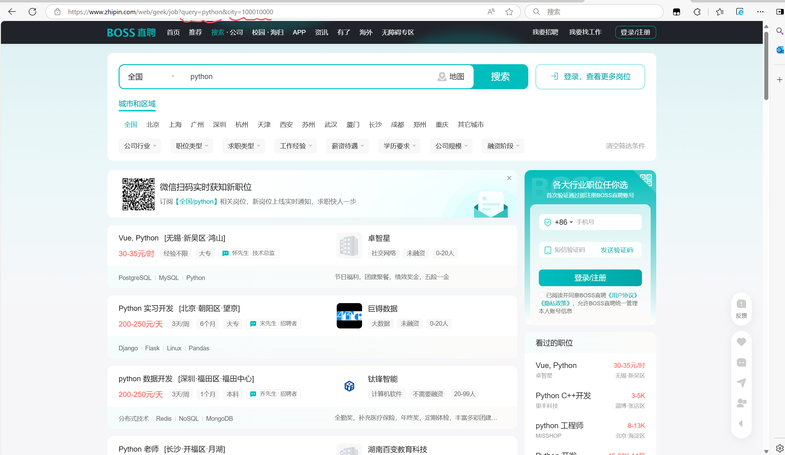

网址中 可以发现有两个参数 `qurey=python` 和`city=100010000`

我们再搜索一个求职信息如 `java`

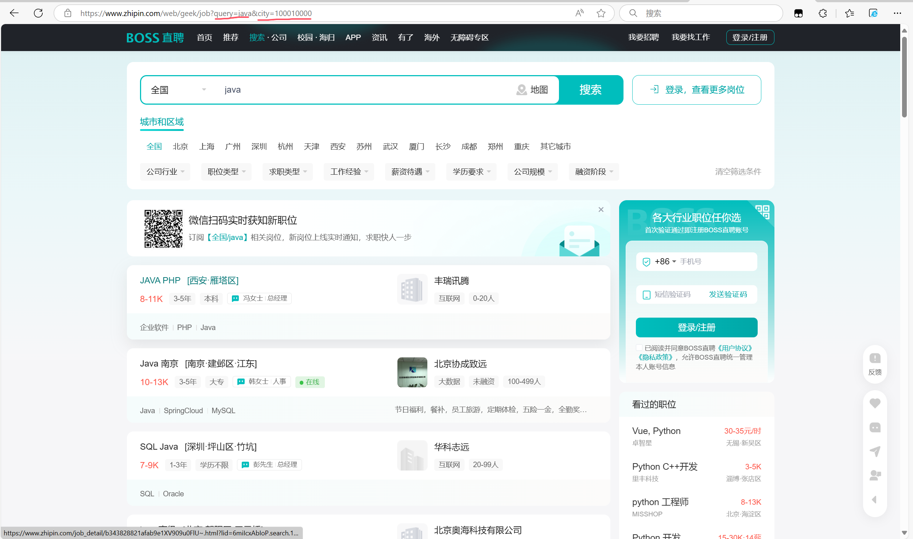

发现参数`qurey=java`和`city=100010000`

通过对比两个网址
`qurey`代表求职信息即我们搜索框中输入的内容
`city`可以知道是职业的地区参数， `100010000`对应的是全国参数

现在的问题就是每个城市对应的参数是什么

返回到主页，按`F12`打开开发者工具，选择网络一栏

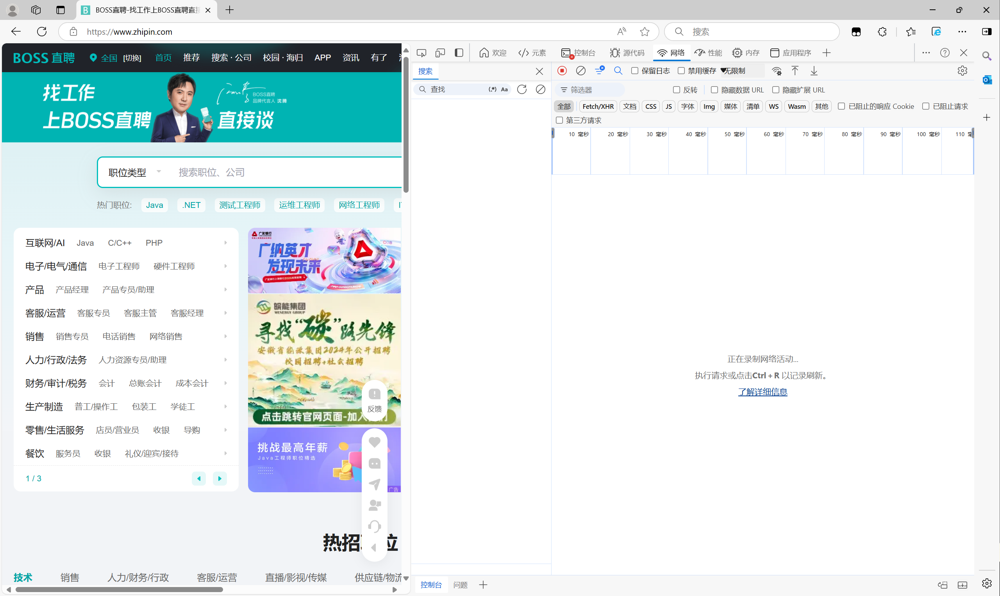

刷新一下网页（若网络一栏无文件，则需要刷新网页），搜索框中搜索city

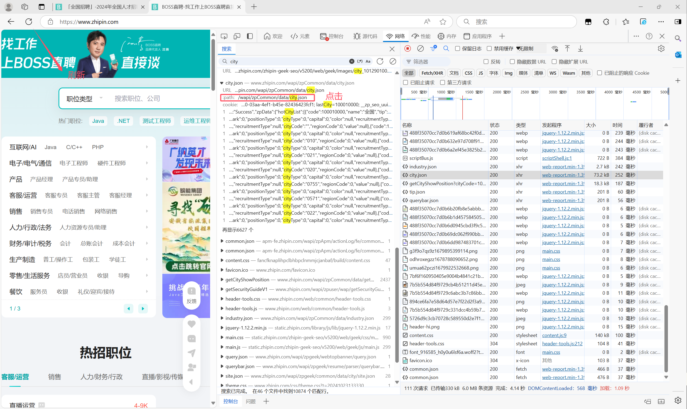

找到`city.json`（就是城市的参数文件）

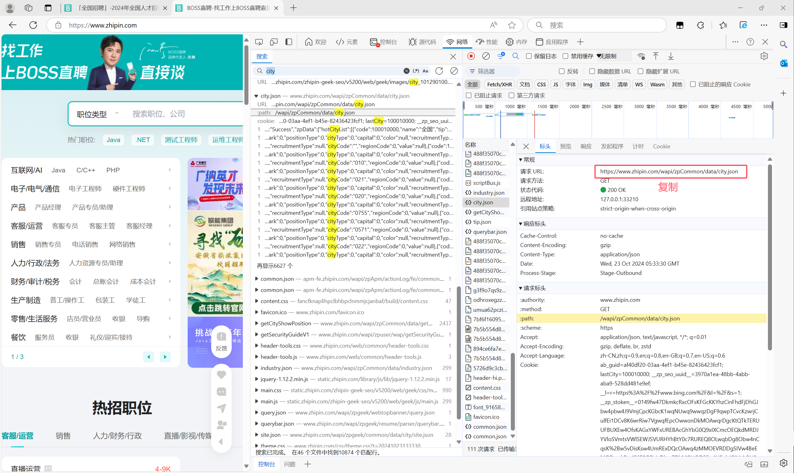

访问网址 !!!

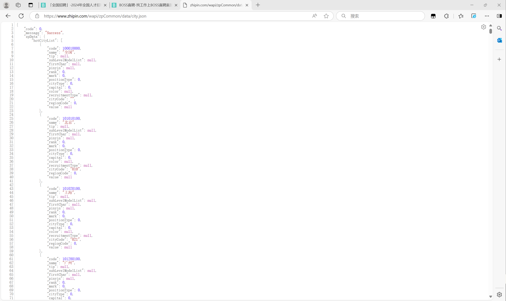

每个城市对应的参数都在该网址

### 招聘信息获取

刚刚我们获取完url的两个参数信息

以`qurey=python city=100010000` 举例
所以对应的url = `https://www.zhipin.com/web/geek/job?query=python&city=100010000`

我们访问网址，打开开发者工具，选择网络一栏

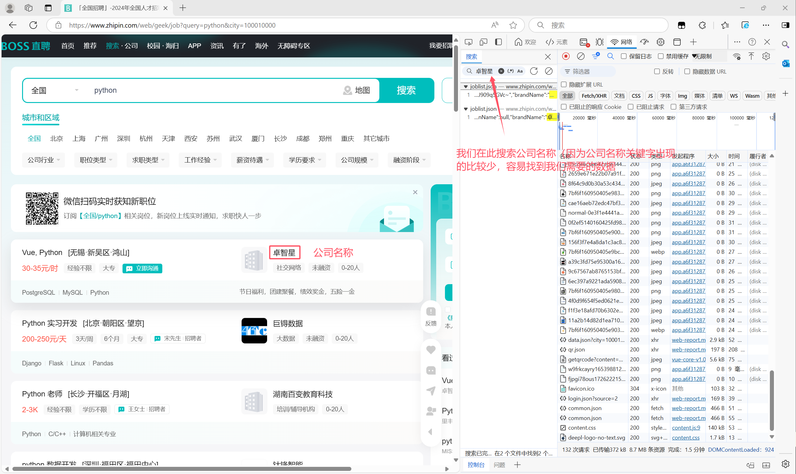

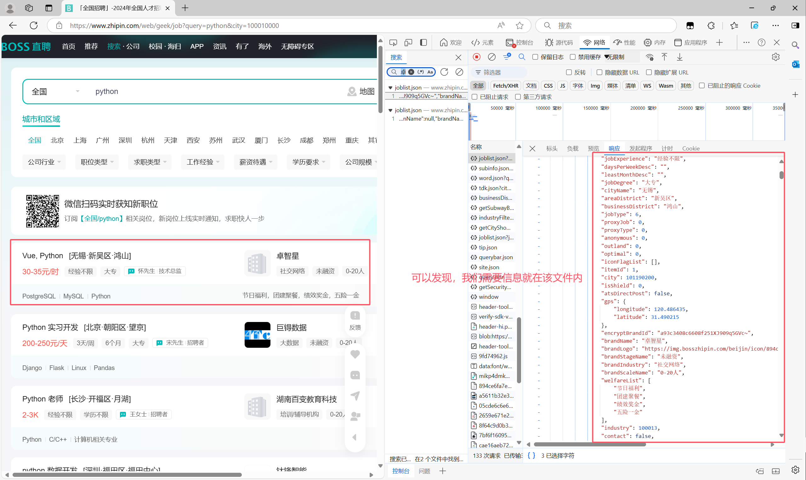

选择 标头 一栏 ，找到请求标头的:path一栏
复制`search/joblist.json` 后面编写代码需要

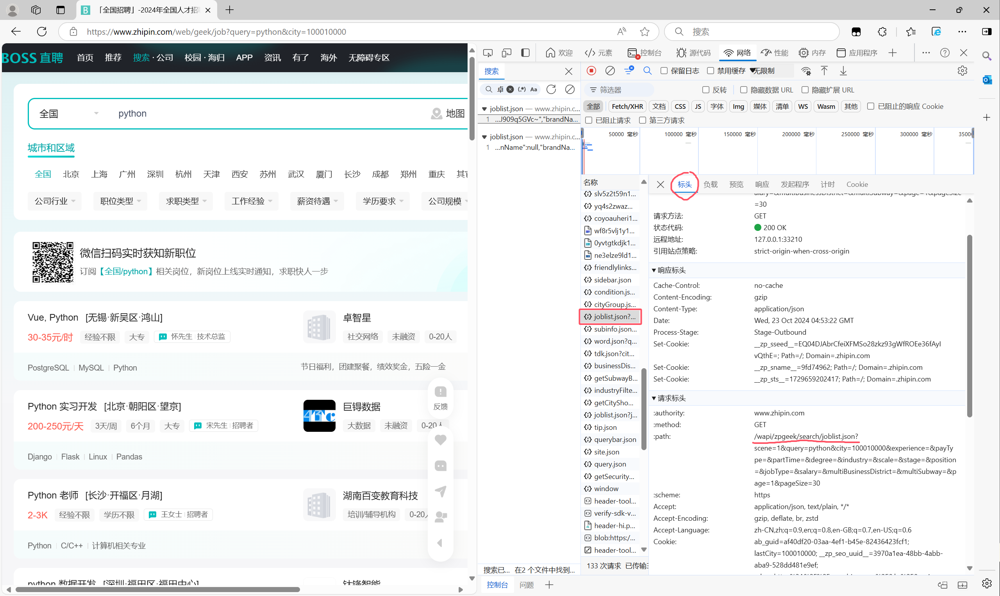

以上，我们就完成了编写代码的准备环节

### 代码编写

用到的包`DrissionPage`

[使用文档](https://www.drissionpage.cn/get_start/installation)

#### ✅️️ URL获取模块

``` python
    def _get_city_code(self):
        """获取城市编码"""
        #生成页面对象
        page = SessionPage()
        #访问在线网页
        page.get('https://www.zhipin.com/wapi/zpCommon/data/city.json')#刚刚获取到的city.json网址
        json_data = page.json['zpData']['cityList']
        for dit in json_data:
            for city_json in dit['subLevelModelList']:
                if city_json['name'] == self.city:
                    return str(city_json['code'])
        return '100010000'  # 默认值为全国
    def _get_url(self):
        """根据关键词和城市编码生成正确的URL"""
        #正则表达式进行替换
        self.url = re.sub(r'(?<=query=)[^&]+', self.keyword, self.url)
        self.url = re.sub(r'(?<=city=)[^&]+', self._get_city_code(), self.url)
        print(self.url)
        return self.url
```

::: tip 提示

page.json返回的是一个字典类型

`'zpData'`访问的是

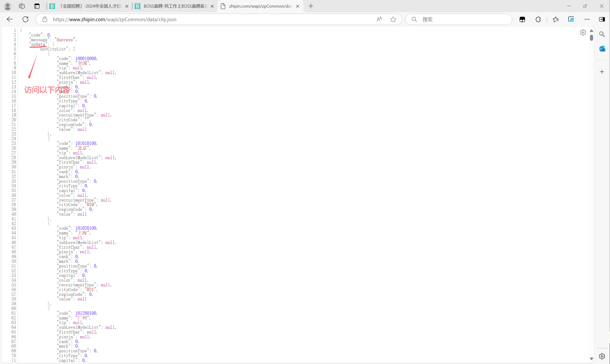

`'cityList'`访问的是

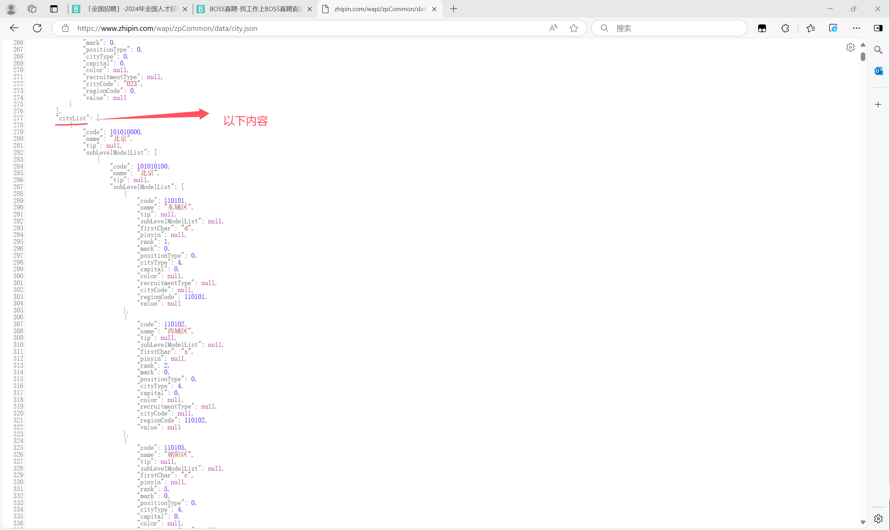

这里的`dit['subLevelModelList']`代表

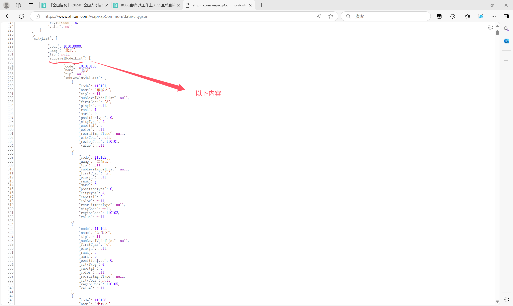

:::

#### ✅️ 数据抓取

```python
def run(self):
    """爬取数据并写入CSV"""
    page = None
    try:
        #ChromiumPage区别于SessionPage，它是一个可交互性的网页
        page = ChromiumPage()
        
        page.listen.start('search/joblist.json')#此处是我们要在网络中获取的数据文件
        page.get(self._get_url())
        for page_num in range(1000):  # 翻页处理
            page.scroll.to_bottom()  # 滚动到页面底部，加载新内容
            response = page.listen.wait()  # 等待监听到的请求响应
            json_data = response.response.body
            jobList = json_data['zpData']['jobList']
            for job in jobList:
                data = {
                    '职位': job['jobName'],
                    '城市': job['cityName'],
                    '公司': job['brandName'],
                    '薪资': job['salaryDesc'],
                    '经验': job['jobExperience'],
                    '学历': job['jobDegree'],
                    '领域': job['brandIndustry'],
                    '技能': ', '.join(job['skills']),
                    '福利': ', '.join(job['welfareList']),
                }
                self.csv_writer.writerow(data)

            # 翻页操作
            next_page_btn = page.ele('css:.options-pages a:last-of-type')
            if 'disable' in next_page_btn.attr('class'):
                break
            else:
                next_page_btn.click()  # 点击下一页按钮
    except Exception as e:
        print(f"发生错误: {e}")
    finally:
        if page:
            page.quit()  # 关闭浏览器实例
```
::: tip 提示

关于翻页操作的参数

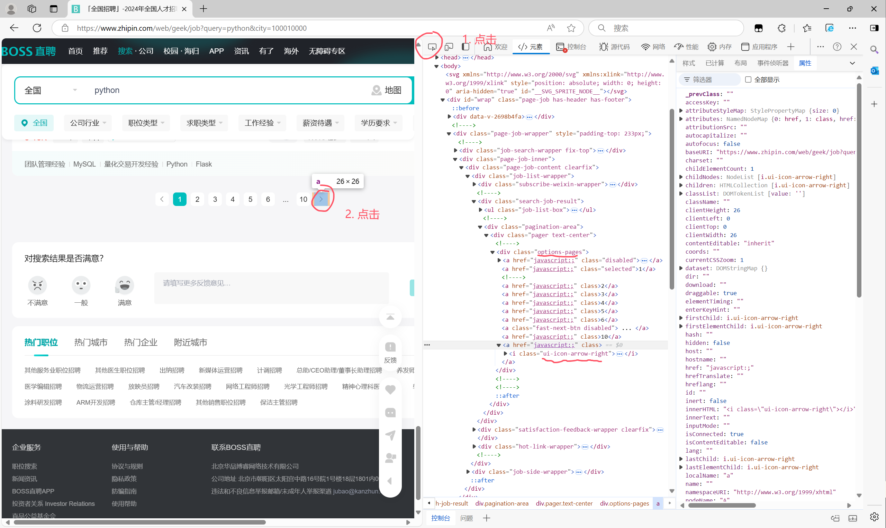

可以看到下一页的按钮标签名称为 `ui-icon-arrow-right`

但是同上操作在最后一页下一页的按钮为 `disabled`

为此做一个区分，下一页的标签在 `class = "options-pages"` 的最后一个，所以我们使用`'css:.options-pages a:last-of-type'`来获取最后一个元素，来判断是否进行下一页

:::

源代码如下

```python
from DrissionPage import SessionPage, ChromiumPage
import re
import csv

class Boss(object):
    def __init__(self, keyword, city):
        self.keyword = keyword
        self.city = city
        self.url = 'https://www.zhipin.com/web/geek/job?query=python&city=101200100'

        # 替换掉文件名中的非法字符
        safe_keyword = self.keyword.replace('/', '_').replace('\\', '_').replace(':', '_')
        safe_city = self.city.replace('/', '_').replace('\\', '_').replace(':', '_')

        # 生成文件名
        file_name = f'Boss直聘_关键词_{safe_keyword}_城市_{safe_city}.csv'

        try:
            self.f = open(file_name, mode='w', encoding='utf-8', newline='')
            self.csv_writer = csv.DictWriter(self.f, fieldnames=[
                '职位',
                '城市',
                '公司',
                '薪资',
                '经验',
                '学历',
                '领域',
                '技能',
                '福利',
            ])
            self.csv_writer.writeheader()
        except Exception as e:
            print(f"打开文件时发生错误: {e}")
            self.f = None  # 确保如果文件打开失败，self.f 不会被引用

    def __del__(self):
        """确保在对象销毁时关闭CSV文件"""
        if hasattr(self, 'f') and self.f:  # 检查是否存在 f 属性
            self.f.close()

    def _get_city_code(self):
        """获取城市编码"""
        page = SessionPage()
        page.get('https://www.zhipin.com/wapi/zpCommon/data/city.json')
        json_data = page.json['zpData']['cityList']
        for dit in json_data:
            for city_json in dit['subLevelModelList']:
                if city_json['name'] == self.city:
                    return str(city_json['code'])
        return '100010000'  # 默认值为全国

    def _get_url(self):
        """根据关键词和城市编码生成正确的URL"""
        self.url = re.sub(r'(?<=query=)[^&]+', self.keyword, self.url)
        self.url = re.sub(r'(?<=city=)[^&]+', self._get_city_code(), self.url)
        print(self.url)
        return self.url

    def run(self):
        """爬取数据并写入CSV"""
        page = None
        try:
            page = ChromiumPage()
            page.listen.start('search/joblist.json')
            page.get(self._get_url())
            for page_num in range(1000):  # 翻页处理
                page.scroll.to_bottom()  # 滚动到页面底部，加载新内容
                response = page.listen.wait()  # 等待监听到的请求响应
                json_data = response.response.body
                jobList = json_data['zpData']['jobList']
                for job in jobList:
                    data = {
                        '职位': job['jobName'],
                        '城市': job['cityName'],
                        '公司': job['brandName'],
                        '薪资': job['salaryDesc'],
                        '经验': job['jobExperience'],
                        '学历': job['jobDegree'],
                        '领域': job['brandIndustry'],
                        '技能': ', '.join(job['skills']),
                        '福利': ', '.join(job['welfareList']),
                    }
                    self.csv_writer.writerow(data)

                # 翻页操作
                next_page_btn = page.ele('css:.options-pages a:last-of-type')
                if 'disable' in next_page_btn.attr('class'):
                    break
                else:
                    next_page_btn.click()  # 点击下一页按钮
        except Exception as e:
            print(f"发生错误: {e}")
        finally:
            if page:
                page.quit()  # 关闭浏览器实例


if __name__ == '__main__':
    city = input('请输入城市名：')
    keyword = input('请输入搜索关键词：')

    # 确保用户输入不为空
    if keyword:
        boss_spider = Boss(keyword=keyword, city=city)
        boss_spider.run()
    else:
        print("关键词和城市名不能为空！")


```

## 2. 智联招聘

### URL获取

打开官网[智联招聘](https://www.zhaopin.com/)

同理

基础URL
`https://www.zhaopin.com/sou/?jl=489&kw=python&p=2`

参数有3个，jl=城市，kw=招聘岗位，p=页面

[城市参数网址](https://fe-api.zhaopin.com/c/i/search/base/data)

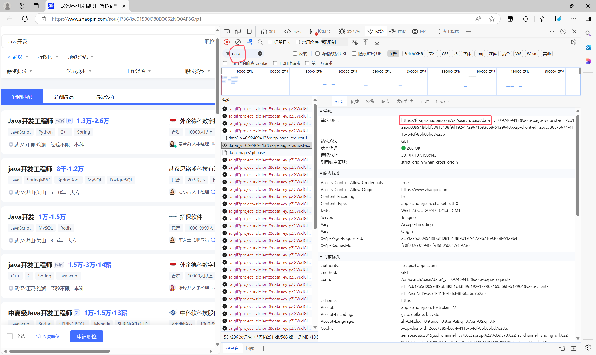

每个城市对应的参数都在该网址

### 招聘信息获取

有别于Boss直聘

你在搜索公司名称时，发现找不到对应的json文件

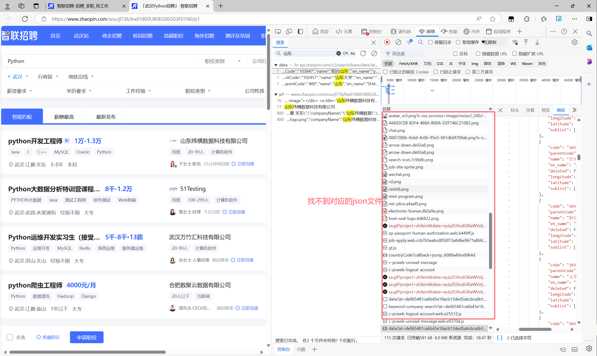

但我们翻到第二页的时候

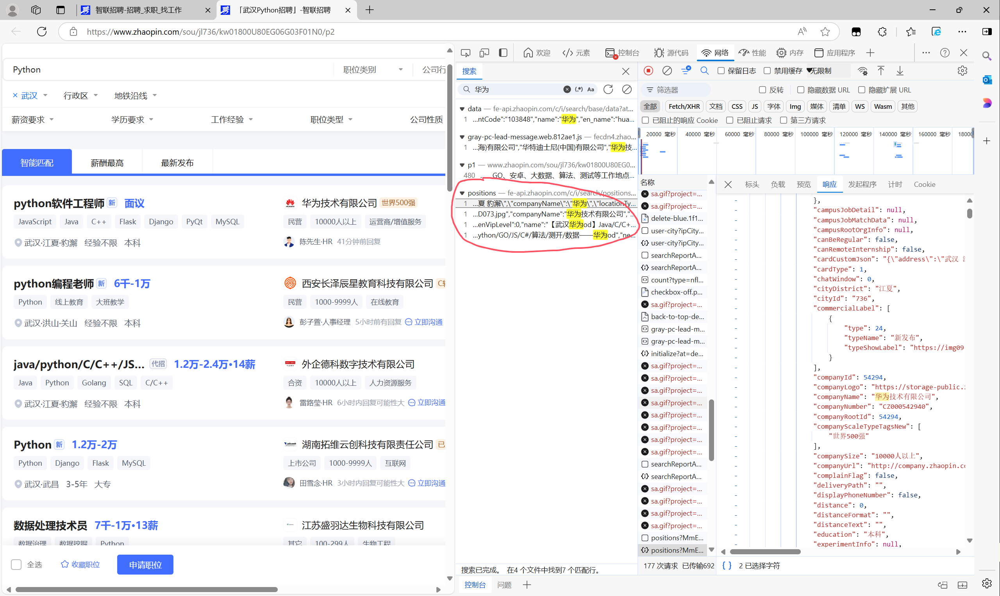

对应的文件找到了

获取到:path: !!`search/positions`!!

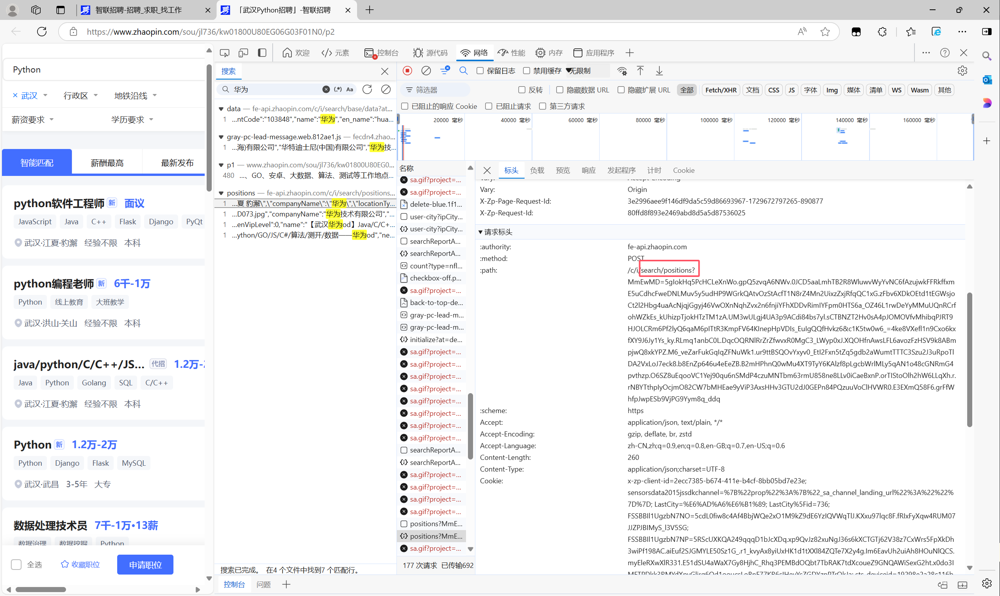

### 代码编写

用到的包`DrissionPage`

[使用文档](https://www.drissionpage.cn/get_start/installation)

#### ✅️️ URL获取模块

``` python
        def _get_city_code(self):
        """获取城市编码"""
        page = SessionPage()
        page.get('https://fe-api.zhaopin.com/c/i/search/base/data')
        json_data = page.json['data']['allCity']
        for dit in json_data:
            if dit['name'] == self.city:
                return str(dit['code'])
            for city_json in dit['sublist']:
                if city_json['name'] == self.city:
                    return str(city_json['code'])
        return '489'  # 默认值为全国

    def _get_url(self):
        """根据关键词和城市编码生成正确的URL"""
        self.url = re.sub(r'(?<=jl=)[^&]+', self._get_city_code(), self.url)
        self.url = re.sub(r'(?<=kw=)[^&]+', self.keyword, self.url)
        print(self.url)
        return self.url
```

#### ✅️ 数据抓取

```python
    def run(self):
        """爬取数据并写入CSV"""
        page = None
        try:
            page = ChromiumPage()
            page.listen.start('/search/positions')
            page.get(self._get_url())
            page.scroll.to_bottom()  # 滚动到页面底部，加载新内容
            page.ele('css:.soupager__btn').click()
            for page_num in range(1000):  # 翻页处理
                page.scroll.to_bottom()  # 滚动到页面底部，加载新内容
                response = page.listen.wait()  # 等待监听到的请求响应
                json_data = response.response.body
                jobList = json_data['data']['list']
                for job in jobList:
                    data = {
                        '职位': job['name'],
                        '城市': job['workCity'],
                        '公司': job['companyName'],
                        '薪资': job['salary60'],
                        '经验': job['workingExp'],
                        '学历': job['education'],
                        '领域': job['industryName'],
                        '技能': ', '.join(skill['name'] for skill in job['jobSkillTags']),
                        '福利': ', '.join(job['jobKnowledgeWelfareFeatures']),
                    }
                    self.csv_writer.writerow(data)
                # 翻页操作
                next_page_btn = page.ele('css:.soupager a:last-of-type')
                if 'soupager__btn--disable' in next_page_btn.attr('class'):
                    break
                else:
                    next_page_btn.click()  # 点击下一页按钮
        except Exception as e:
            print(f"发生错误: {e}")
        finally:
            if page:
                page.quit()  # 关闭浏览器实例
```
::: tip 提示

关于翻页操作的参数

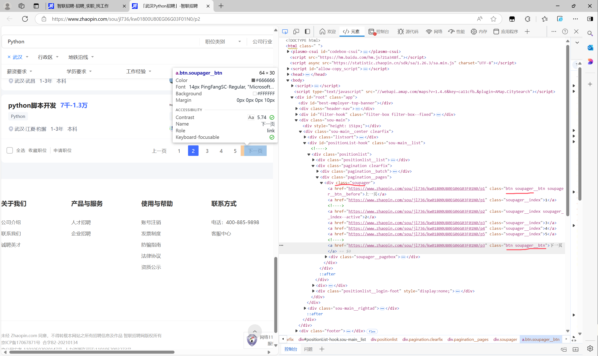

可以看到上一页和下一页的按钮标签名称都为 `btn soupager__btn`

为此做一个区分，下一页的标签在 `class = "soupager"` 的最后一个，所以我们使用`'css:.soupager a:last-of-type'`来获取最后一个元素，来判断是否进行下一页

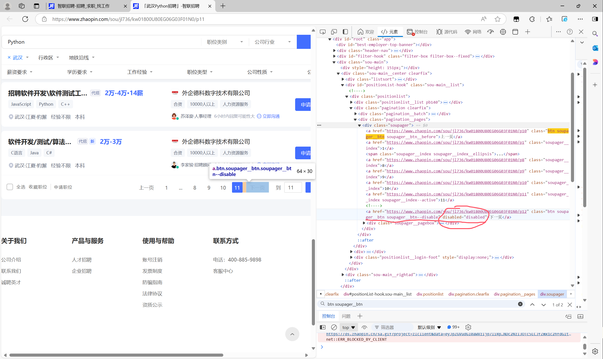

最后一页的下一页的标签为 `'soupager__btn--disable'`

:::

源代码如下

```python
import time
from DrissionPage import SessionPage, ChromiumPage
import re
import csv
class Zhilian(object):
    def __init__(self, keyword, city):
        self.keyword = keyword
        self.city = city
        self.url = 'https://www.zhaopin.com/sou/?jl=489&kw=python&p=2'

        # 替换掉文件名中的非法字符
        safe_keyword = self.keyword.replace('/', '_').replace('\\', '_').replace(':', '_')
        safe_city = self.city.replace('/', '_').replace('\\', '_').replace(':', '_')

        # 生成文件名
        file_name = f'智联招聘_关键词_{safe_keyword}_城市_{safe_city}.csv'
        try:
            self.f = open(file_name, mode='w', encoding='utf-8', newline='')
            self.csv_writer = csv.DictWriter(self.f, fieldnames=[
                '职位',
                '城市',
                '公司',
                '薪资',
                '经验',
                '学历',
                '领域',
                '技能',
                '福利',
            ])
            self.csv_writer.writeheader()
        except Exception as e:
            print(f"打开文件时发生错误: {e}")
            self.f = None  # 确保如果文件打开失败，self.f 不会被引用

    def __del__(self):
        """确保在对象销毁时关闭CSV文件"""
        if hasattr(self, 'f') and self.f:  # 检查是否存在 f 属性
            self.f.close()

    def _get_city_code(self):
        """获取城市编码"""
        page = SessionPage()
        page.get('https://fe-api.zhaopin.com/c/i/search/base/data')
        json_data = page.json['data']['allCity']
        for dit in json_data:
            if dit['name'] == self.city:
                return str(dit['code'])
            for city_json in dit['sublist']:
                if city_json['name'] == self.city:
                    return str(city_json['code'])
        return '489'  # 默认值为全国

    def _get_url(self):
        """根据关键词和城市编码生成正确的URL"""
        self.url = re.sub(r'(?<=jl=)[^&]+', self._get_city_code(), self.url)
        self.url = re.sub(r'(?<=kw=)[^&]+', self.keyword, self.url)
        print(self.url)
        return self.url

    def run(self):
        """爬取数据并写入CSV"""
        page = None
        try:
            page = ChromiumPage()
            page.listen.start('/search/positions')
            page.get(self._get_url())
            time.sleep(2)
            page.scroll.to_bottom()  # 滚动到页面底部，加载新内容
            page.ele('css:.soupager__btn').click()
            for page_num in range(1000):  # 翻页处理
                page.scroll.to_bottom()  # 滚动到页面底部，加载新内容
                response = page.listen.wait()  # 等待监听到的请求响应
                json_data = response.response.body
                jobList = json_data['data']['list']
                for job in jobList:
                    data = {
                        '职位': job['name'],
                        '城市': job['workCity'],
                        '公司': job['companyName'],
                        '薪资': job['salary60'],
                        '经验': job['workingExp'],
                        '学历': job['education'],
                        '领域': job['industryName'],
                        '技能': ', '.join(skill['name'] for skill in job['jobSkillTags']),
                        '福利': ', '.join(job['jobKnowledgeWelfareFeatures']),
                    }
                    self.csv_writer.writerow(data)
                # 翻页操作
                next_page_btn = page.ele('css:.soupager a:last-of-type')
                if 'soupager__btn--disable' in next_page_btn.attr('class'):
                    break
                else:
                    next_page_btn.click()  # 点击下一页按钮
        except Exception as e:
            print(f"发生错误: {e}")
        finally:
            if page:
                page.quit()  # 关闭浏览器实例


if __name__ == '__main__':
    city = input('请输入城市名：')
    keyword = input('请输入搜索关键词：')

    # 确保用户输入不为空
    if keyword:
        Zhilian_spider = Zhilian(keyword=keyword, city=city)
        Zhilian_spider.run()
    else:
        print("关键词和城市名不能为空！")


```
## 3. 前程无忧

打开官网[前程无忧](https://www.51job.com/)

::: info 前情提要

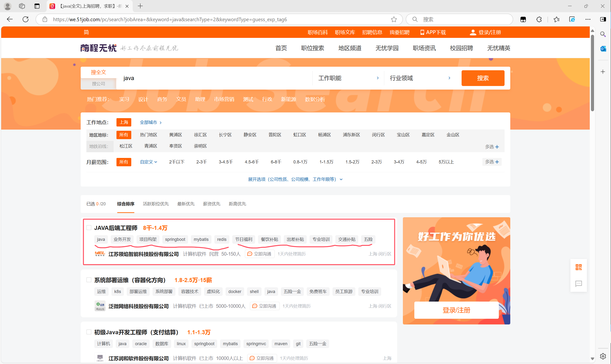

由于该网站招聘信息 技能要求和福利 等信息在一块，后期数据处理很麻烦，故在这里只教程如何爬取内容

:::

### URL获取

`https://we.51job.com/pc/search?jobArea=020000&keyword=java&searchType=2&keywordType=`

四个参数

jobArea 城市参数
keyword 职业关键字
searchType 1 搜公司 2 搜全文
keywordType 作用不大

城市参数 `https://js.51jobcdn.com/in/js/2023/dd/dd_city.json`

监听参数 `job/search-pc`

::: important 但是

[例子](https://we.51job.com/api/job/search-pc?api_key=51job&timestamp=1729683309&keyword=java%5C&searchType=2&function=&industry=&jobArea=020000&jobArea2=&landmark=&metro=&salary=&workYear=&degree=&companyType=&companySize=&jobType=&issueDate=&sortType=0&pageNum=1&requestId=&keywordType=&pageSize=20&source=1&accountId=&pageCode=sou%7Csou%7Csoulb)

需要手动验证

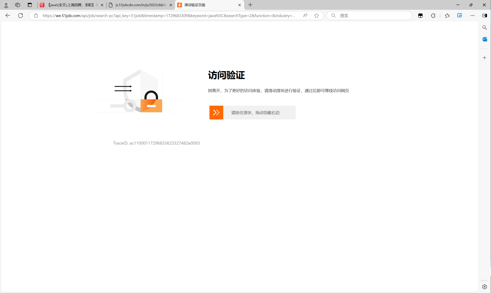

所以该网站不能像前面俩一样爬取（大家可以尝试编写代码，突破验证）

通过直接爬取网页元素（该方法相较于前面，比较麻烦）

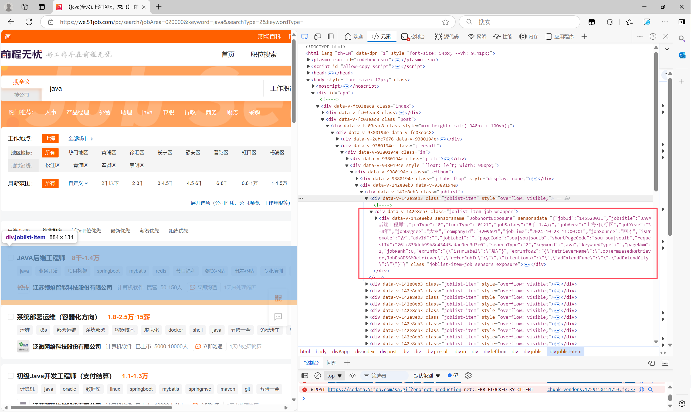

:::

### 简单demo编写

根据页面元素可以得到，页面中一个工作的信息包含在 `class=joblist_item`中
所以我们可以通过`ChromiumPage()`对象的`eles`方法获取页面中所有`joblist_item`

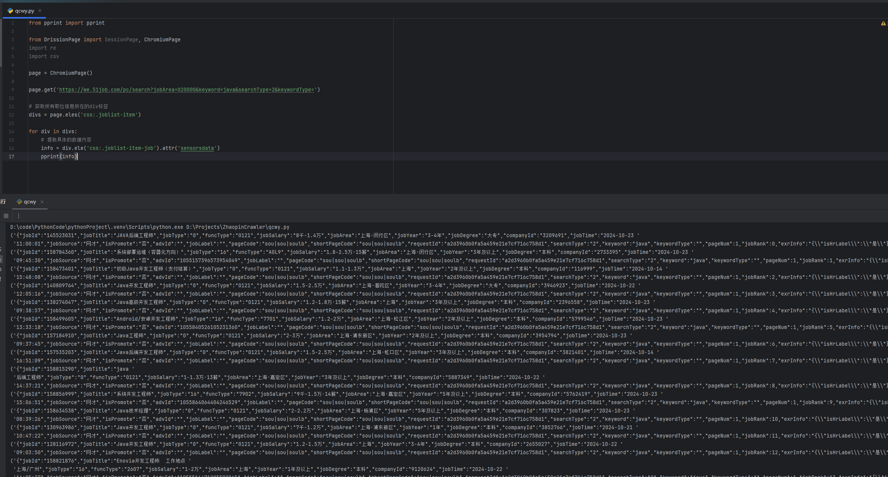

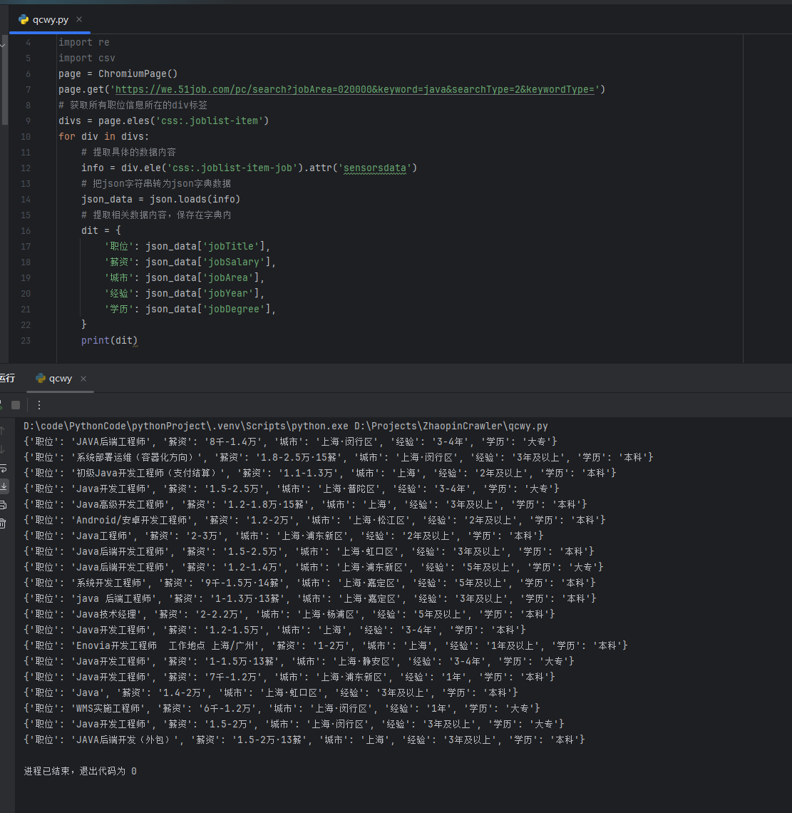

公司信息如图所示

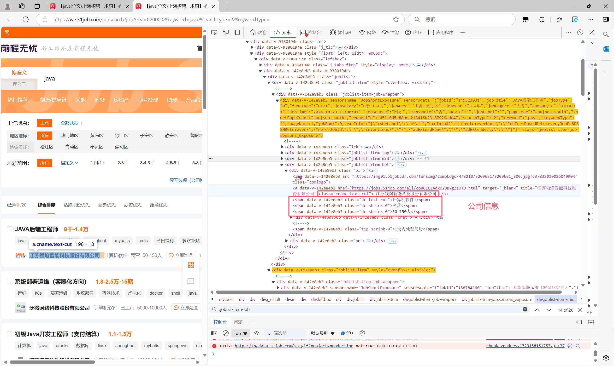

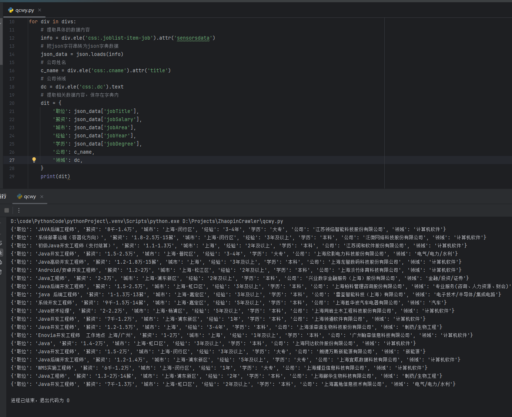

公司标签如图所示

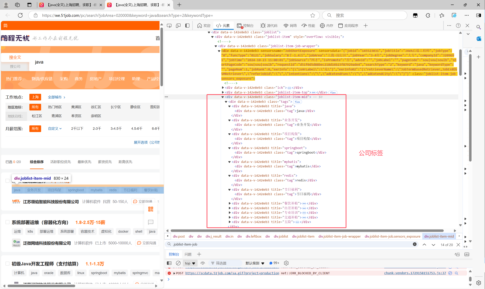

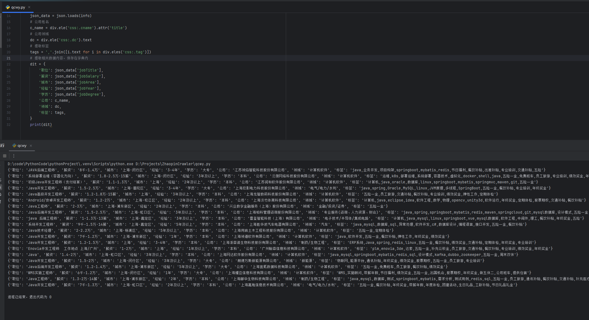

```python
import json
from pprint import pprint
from DrissionPage import SessionPage, ChromiumPage
page = ChromiumPage()
page.get('https://we.51job.com/pc/search?jobArea=020000&keyword=java&searchType=2&keywordType=')
# 获取所有职位信息所在的div标签
divs = page.eles('css:.joblist-item')
for div in divs:
    # 提取具体的数据内容
    info = div.ele('css:.joblist-item-job').attr('sensorsdata')
    # 把json字符串转为json字典数据
    json_data = json.loads(info)
    # 公司姓名
    c_name = div.ele('css:.cname').attr('title')
    # 公司领域
    dc = div.ele('css:.dc').text
    # 提取标签
    tags = ','.join([i.text for i in div.eles('css:.tag')])
    # 提取相关数据内容，保存在字典内
    dit = {
        '职位': json_data['jobTitle'],
        '薪资': json_data['jobSalary'],
        '城市': json_data['jobArea'],
        '经验': json_data['jobYear'],
        '学历': json_data['jobDegree'],
        '公司': c_name,
        '领域': dc,
        '标签': tags,
    }
    print(dit)

```

以上就是 前程无忧 网站信息爬取过程