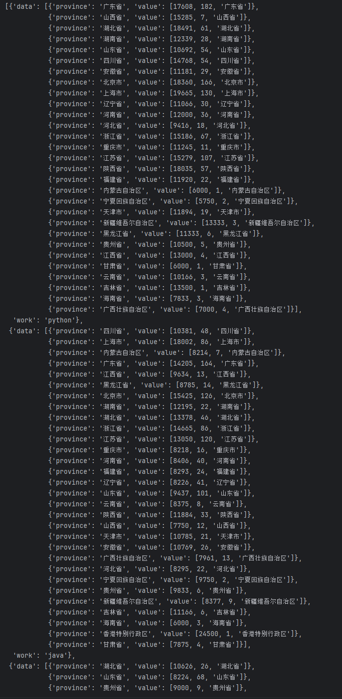
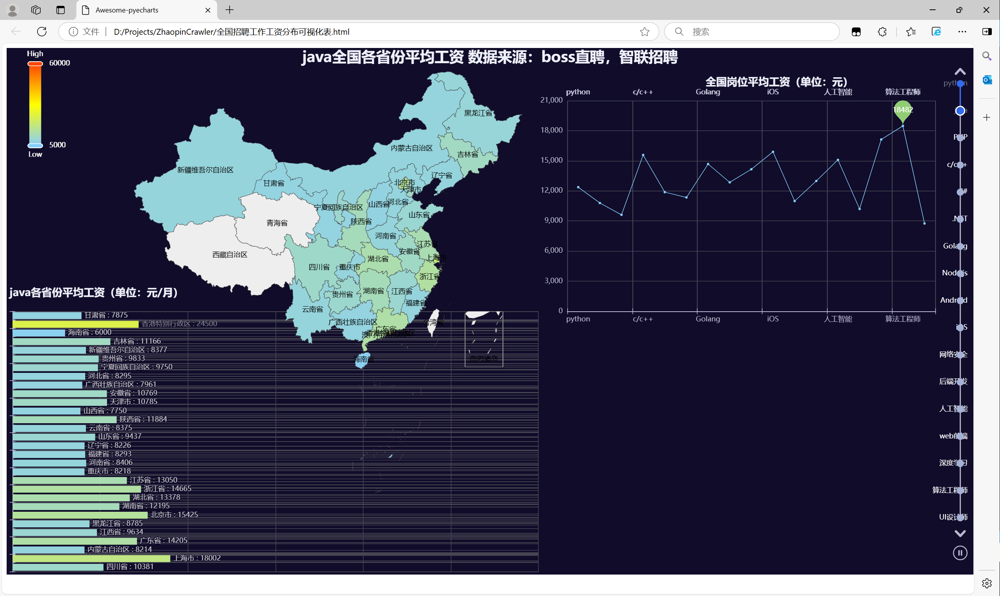

本教程将指导你如何制作可视化图表 。

<!-- more -->

::: info 前言

需要用到的库有 `jupyter notebook` 、`pyecharts`

安装`jupyter notebook`
```bash

pip install jupyter notebook

```
运行`jupyter notebook`
```bash

jupyter notebook

```

```bash

pip install pyecharts

```

官方文档可参考[pyecharts](https://pyecharts.org/#/zh-cn/intro)

以及一些表格的例子[pyecharts-gallery](https://gallery.pyecharts.org/#/README?id=%e9%a1%b9%e7%9b%ae%e9%a1%bb%e7%9f%a5)

:::

## 1. 全国招聘工作工资分布可视化表.html

### 数据获取

```python
# 之前数据清洗过之后的文件
file = f'data.csv' 
df = pd.read_csv(file)
data = []
work = {}
for index, row in df.iterrows():
    keyword = row['keyword']
    province = row['name']
    averSalary = row['averSalary']
    number = row['number']
    if keyword not in work:
        work[keyword] = {'work': keyword, 'data': []}
    work[keyword]['data'].append({
                                  'province': province,
                                  'value': [averSalary, number, province]
                                  })
data = list(work.values())

work_list = ['python', 'java', 'PHP', 'c/c++', 'C#', '.NET', 'Golang', 'Node.js', 'Android', 'iOS', '网络安全', '后端开发', '人工智能', 'web前端', '深度学习', '算法工程师', 'UI设计师']

# 数据清洗中得出的平均工资
total_num = [12373, 10794, 9616, 15584, 11876, 11348, 14679, 12854, 14158, 15898, 10988, 12989, 15096, 10200, 17128, 18482, 8751]
maxNum = 60000 # 定义的最大值
minNum = 5000  # 定义的最小值

```

生成的 data 如下



### map_chart（地图）

若需要知道具体数据作用，请参照 [使用文档](https://pyecharts.org/#/zh-cn/geography_charts?id=map%ef%bc%9a%e5%9c%b0%e5%9b%be)

```python
map_data = [
        [[x["province"], x["value"]] for x in d["data"]] for d in data if d["work"] == work
    ][0]
    
    min_data, max_data = (minNum, maxNum)
    map_chart = (
        Map()
        .add(
            series_name="",
            data_pair=[[x[0], x[1][0]] for x in map_data], # 传入的为二维列表，对应的为省份名称和对应职位的工资 （相当于横纵坐标）
            zoom=1, # 地图的缩放比
            center=[130, 25],
            is_map_symbol_show=False,
            tooltip_opts=opts.TooltipOpts(is_show=True, formatter="{b}: {c}"), # 设置鼠标放置旁边时，显示具体数据
        )
        .set_global_opts(
            title_opts=opts.TitleOpts(
                title="" + str(work) + "全国各省份平均工资 数据来源：boss直聘，智联招聘", # 标题
                subtitle="", 
                pos_left="center",
                pos_top="top",
                title_textstyle_opts=opts.TextStyleOpts(
                    font_size=25
                ),
            ),
            tooltip_opts=opts.TooltipOpts(
                is_show=True,
                formatter=JsCode(
                    """function(params) {
                    if ('value' in params.data) {
                        return params.data.value[2] + ': ' + params.data.value[0];
                    }
                }"""
                ),
            ),
            # 设置热力图
            visualmap_opts=opts.VisualMapOpts(
                is_calculable=True,
                dimension=0,
                pos_left="30",
                pos_top="top",
                range_text=["High", "Low"],
                range_color=["lightskyblue", "yellow", "orangered"],# 定义热力图中的颜色
                textstyle_opts=opts.TextStyleOpts(color="#ddd"),
                min_=min_data,
                max_=max_data, # 定义热力图的最大值和最小值
            ),
        )
    )
```
### line_chart（折线图）

若需要知道具体数据作用，请参照 [使用文档](https://pyecharts.org/#/zh-cn/rectangular_charts?id=line%ef%bc%9a%e6%8a%98%e7%ba%bf%e9%9d%a2%e7%a7%af%e5%9b%be)

```python
 line_chart = (
        Line()
        .add_xaxis(work_list) # 横坐标
        .add_yaxis(
                   '', 
                   total_num, # 纵坐标
                   markpoint_opts=opts.MarkPointOpts(data=[opts.MarkPointItem(type_="max")]), # 展示所有数据中最大的一项
                    tooltip_opts=opts.TooltipOpts(is_show=True, formatter="{c}"), # 设置鼠标放置旁边时，显示具体数据
                   )
        .set_series_opts(label_opts=opts.LabelOpts(is_show=False)) 
        .set_global_opts(
            title_opts=opts.TitleOpts(
                title="全国岗位平均工资（单位：元）", pos_left="72%", pos_top="5%" #标题
            )
        )
    )
```

### bar_chart（柱状图）

若需要知道具体数据作用，请参照 [使用文档](https://pyecharts.org/#/zh-cn/rectangular_charts?id=bar%ef%bc%9a%e6%9f%b1%e7%8a%b6%e5%9b%be%e6%9d%a1%e5%bd%a2%e5%9b%be)

```python
    bar_x_data = [x[0] for x in map_data] # 横坐标
    bar_y_data = [{"work": x[0], "value": x[1][0]} for x in map_data] #纵坐标
    bar = (
        Bar()
        .add_xaxis(xaxis_data=bar_x_data)
        .add_yaxis(
            series_name="",
            y_axis=bar_y_data,
            label_opts=opts.LabelOpts(
                is_show=True, position="right", formatter="{b} : {c}" # 将具体数据固定在表格的右边
            ),
        )
        .reversal_axis()
        .set_global_opts(
            title_opts=opts.TitleOpts(
                title="" + str(work) + "各省份平均工资（单位：元/月）", pos_left="0%", pos_top="45%" # 标题
            ),
            xaxis_opts=opts.AxisOpts(
                max_=60000, axislabel_opts=opts.LabelOpts(is_show=False)
            ),
            yaxis_opts=opts.AxisOpts(axislabel_opts=opts.LabelOpts(is_show=False)),
            tooltip_opts=opts.TooltipOpts(is_show=False),
        )
    )
```
### grid_chart（并行多图）

若需要知道具体数据作用，请参照 [使用文档](https://pyecharts.org/#/zh-cn/composite_charts?id=grid%ef%bc%9a%e5%b9%b6%e8%a1%8c%e5%a4%9a%e5%9b%be)

```python
    grid_chart = (
        Grid()
        .add(
            bar,
            grid_opts=opts.GridOpts(
                pos_left="10", pos_right="45%", pos_top="50%", pos_bottom="5" # 控制表格位置
            ),
        )
        .add(
            line_chart,
            grid_opts=opts.GridOpts(
                pos_left="58%", pos_right="65", pos_top="10%", pos_bottom="50%" # 控制表格位置
            ),
        )
        .add(map_chart, grid_opts=opts.GridOpts())
    )
```

### timeline （时间线）

若需要知道具体数据作用，请参照 [使用文档](https://pyecharts.org/#/zh-cn/composite_charts?id=timeline%ef%bc%9a%e6%97%b6%e9%97%b4%e7%ba%bf%e8%bd%ae%e6%92%ad%e5%a4%9a%e5%9b%be)

```python
    timeline = Timeline(
        init_opts=opts.InitOpts(width="1650px", height="900px", theme=ThemeType.DARK)
    )
    for y in work_list:
        g = get_work_chart(work=y)
        timeline.add(g, time_point=str(y))

    timeline.add_schema(
    orient="vertical",  # 纵向排列
    is_auto_play=True,  # 自动播放
    is_inverse=True,    # 反向播放
    play_interval=5000, # 每个图表间隔5秒
    pos_left="null",    # 左边距设置为 null（自动）
    pos_right="5",      # 右边距设置为 5
    pos_top="20",       # 上边距设置为 20
    pos_bottom="20",    # 下边距设置为 20
    width="60",         # 时间轴的宽度
    label_opts=opts.LabelOpts(is_show=True, color="#fff", position="left"), # 文本位置设置为右侧
    )

    timeline.render("全国招聘工作工资分布可视化表.html")
```

成果展示



